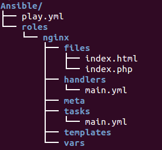

# Note 1:

# Ansible Roles:


<br>

### What are Ansible Roles?

+ Ansible Roles provide a well-defined framework and structure for setting your tasks, variables, handlers, metadata, templates, and other files. They enable us to reuse and share our Ansible code efficiently. This way, we can reference and call them in our playbooks with just a few lines of code while we can reuse the same roles over many projects without the need to duplicate our code.

### Why Roles Are Useful in Ansible ?

+ When starting with Ansible, it’s pretty common to focus on writing playbooks to automate repeating tasks quickly. As new users automate more and more tasks with playbooks and their Ansible skills mature, they reach a point where using just Ansible playbooks is limiting. Ansible Roles to the rescue!

<hr>
<br>



<br>


+ Organizing our Ansible content into roles provides us with a structure that is more manageable than just using playbooks. This might not be evident in minimal projects but as the number of playbooks grows, so does the complexity of our projects


### Components 

+ Below are the components in ansible role which we create by default after running the below command 

```yml
ansible-galaxy init {role_name}
```

+ it will initailize the below components 
    
    + ***defaults:***  Includes default values for variables of the role. Here we define some sane default variables, but they have the lowest priority and are usually overridden by other methods to customize the role.
    
    + ***files:*** Contains static and custom files that the role uses to perform various tasks.
    
    + ***handlers:*** A set of handlers that are triggered by tasks of the role. 
    
    + ***meta:*** Includes metadata information for the role, its dependencies, the author, license, available platform, etc.
    
    + ***tasks:*** A list of tasks to be executed by the role. This part could be considered similar to the task section of a playbook.
    
    + ***templates:*** Contains Jinja2 template files used by tasks of the role. (Read more about how to create an Ansible template.)
    
    + ***tests:*** Includes configuration files related to role testing.
    
    + ***vars:*** Contains variables defined for the role. These have quite a high precedence in Ansible.


### What is node exporter in ansible ? as well as benifits of node exporter

+ Node Exporter is a Prometheus-compatible exporter that scrapes metrics from nodes and exposes them as Prometheus metrics. Ansible is a configuration management and provisioning tool that automates the setup of Node Exporter on remote servers.

### Benefits of using Node Exporter with Ansible:

    
+ ***Automation:*** Ansible automates the setup and configuration of Node Exporter on remote servers, eliminating manual errors and saving time.
    
+ ***Consistency:*** Ansible ensures consistent Node Exporter configuration across multiple servers, maintaining uniformity in monitoring and metrics collection.
    
+ ***Efficient resource allocation:*** By providing granular insights into server performance, Node Exporter enables administrators to proactively identify and resolve potential bottlenecks, optimizing resource allocation and ensuring optimal operation.
    
+ ***Easy scalability:*** Ansible’s automated setup and configuration make it easy to scale Node Exporter deployment across large environments.