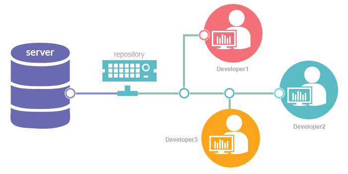
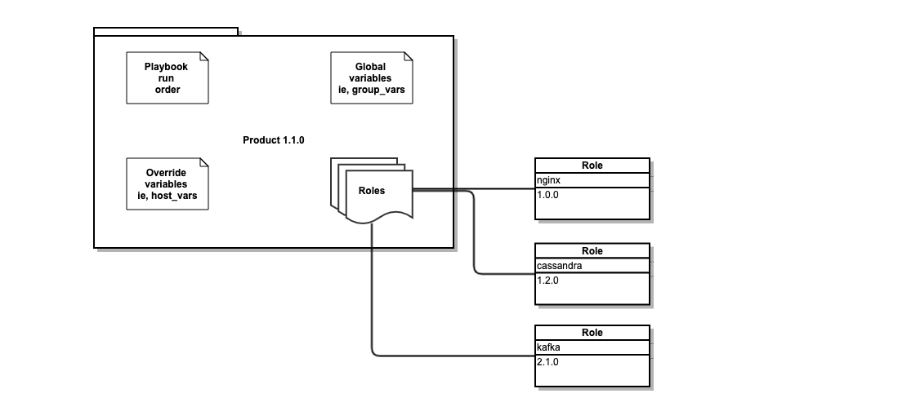

## Note:1

 

 

#### 
Version Control
 

## What is version control ??

+ Version control systems are a category of software tools that helps in recording changes made to files by keeping a track of modifications done in the code. 

+ ### Benefits of the version control system:

    
    + Enhances the project development speed by providing efficient collaboration,
    
    + Leverages the productivity, expedites product delivery, and skills of the employees through better communication and assistance,
    
    + Reduce possibilities of errors and conflicts meanwhile project development through traceability to every small change,
    
    + Employees or contributors of the project can contribute from anywhere irrespective of the different geographical locations through this VCS,
    
    + For each different contributor to the project, a different working copy is maintained and not merged to the main file unless the working copy is validated. The most popular example is Git, Helix core, Microsoft TFS,
    
    + Helps in recovery in case of any disaster or contingent situation,
    
    + Informs us about Who, What, When, Why changes have been made.

 
 

 

### 
Ansible Version Control
 

+ Ansible version control refers to the practice of managing changes and updates to Ansible playbooks, roles, and other automation code using version control systems (VCS) like Git. This approach is crucial for maintaining consistency, tracking changes, and collaborating effectively in teams. 

+ Here’s a breakdown of how it is useful and beneficial:

### Key Benefits of Ansible Version Control

#### Change Tracking and History:

+ ***Audit Trail:*** Keeps a detailed history of all changes made to your automation code. This is crucial for understanding what modifications were made, by whom, and why.
    
+ ***Rollback:*** Allows you to revert to previous versions of playbooks or roles if a new change introduces issues or bugs.
Collaboration:

+ ***Teamwork:*** Facilitates collaboration among multiple team members by allowing them to work on different aspects of the automation code concurrently without overwriting each other’s changes.

+ ***Code Review:*** Supports code review processes where changes can be reviewed and approved before being merged into the main codebase.

### Consistency and Reproducibility:

+ ***Standardization:*** Ensures that the same version of playbooks and roles are used across different environments, leading to more predictable and reproducible automation.

+ ***Environment Management:*** Helps in maintaining consistency across development, staging, and production environments by tracking and deploying specific versions of your automation code.

### Branching and Merging:

+ ***Feature Development:*** Enables development of new features or fixes in separate branches, allowing for isolation of changes until they are fully tested and ready to be merged.

+ ***Release Management:*** Facilitates the management of different versions or releases of automation code, making it easier to deploy updates and manage different versions.

### Documentation and Knowledge Sharing:

+ ***Documentation:*** Provides a way to document changes and decisions within commit messages, which helps in understanding the evolution of the automation code over time.

+ ***Knowledge Transfer:*** Makes it easier for new team members to understand the state of the codebase and the rationale behind various changes.