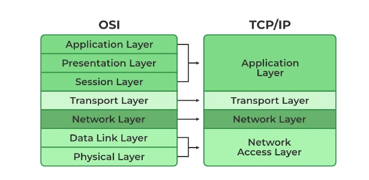
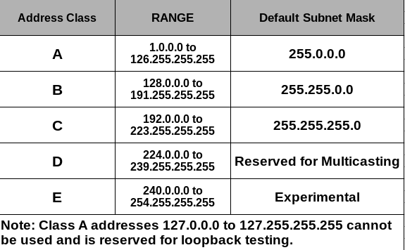
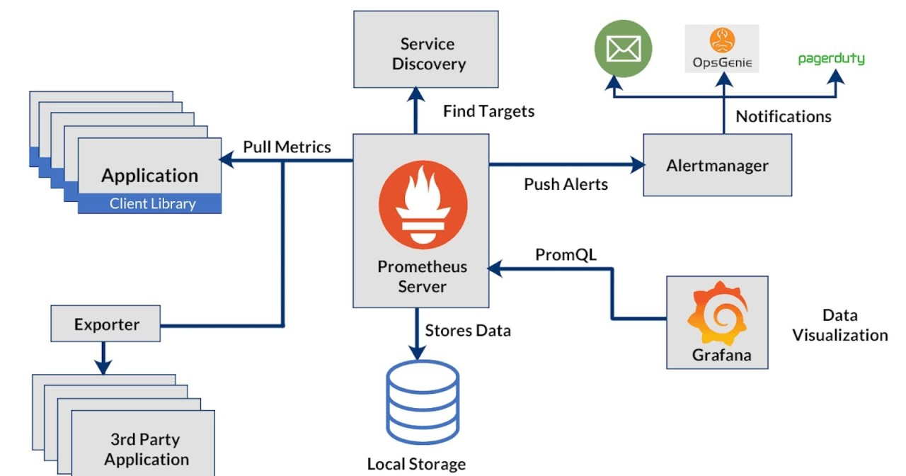

# Notes:

## Use Case: Log Management and Rotation on Ubuntu

### Scenario

+ You have an Ubuntu server running a web application, and you want to manage the logs generated by the application to prevent disk space from being filled up. Additionally, you need to troubleshoot issues using system and application logs.

1. Log Rotation Using logrotate
    + Log rotation is the process of periodically rotating and archiving log files. This helps in managing disk space and keeps logs organized.

### Example Configuration:

+ Let's assume your web application writes logs to /var/log/myapp/myapp.log.
+ Configuration File for logrotate
+ Create a configuration file for your application logs in /etc/logrotate.d/:

```sh
sudo nano /etc/logrotate.d/myapp
```

### Add the following configuration:

```cfg
/var/log/myapp/myapp.log {
    daily
    rotate 7
    compress
    missingok
    notifempty
    create 0640 www-data www-data
    postrotate
        systemctl reload myapp.service
    endscript
}
```
    
+ daily: Rotate the log files daily.
    
+ rotate 7: Keep 7 days' worth of log files.
    
+ compress: Compress the rotated log files to save space.
    
+ missingok: Ignore errors if the log file is missing.
    
+ notifempty: Do not rotate the log if it is empty.
    
+ create 0640 www-data www-data: Create new log files with specific permissions and ownership.
    
+ postrotate: Command to run after rotation (e.g., reload the application service).

2. Steps to Troubleshoot Using Logs

### System Logs

+ System logs contain information about the system's operation. They can be found in the /var/log directory.

### Example Logs:
    
+ /var/log/syslog: General system log.
    
+ /var/log/auth.log: Authentication log.
    
+ /var/log/dmesg: Kernel ring buffer log.

### Application Logs

+ Application logs contain information specific to your application. They help in diagnosing issues related to the application's performance and behavior.

### Example Log:
+ /var/log/myapp/myapp.log: Custom application log.

### Troubleshooting Steps

#### Check System Logs for Errors:

```sh
sudo tail -n 100 /var/log/syslog
sudo tail -n 100 /var/log/auth.log
```

+ Use tail -n 100 to display the last 100 lines of the log file.

#### Check Application Logs:

```bash
sudo tail -n 100 /var/log/myapp/myapp.log
```
#### Search for Specific Errors or Patterns:
+ Use grep to search for specific errors or patterns in the logs.

```sh
sudo grep "ERROR" /var/log/myapp/myapp.log
sudo grep "authentication failure" /var/log/auth.log
```

#### Monitor Logs in Real-Time:
+ Use tail -f to monitor logs in real-time.

```sh
sudo tail -f /var/log/myapp/myapp.log
```
#### Review Logrotate Status:

+ Check the status and configuration of logrotate to ensure logs are being rotated correctly.

```sh
sudo logrotate -d /etc/logrotate.conf
sudo logrotate -f /etc/logrotate.conf
```


### Example Script for Troubleshooting

+ Below is a Bash script that automates the process of checking logs and providing a summary.

```sh
#!/bin/bash

LOG_FILE="/var/log/myapp/myapp.log"
SYSLOG_FILE="/var/log/syslog"
AUTH_LOG_FILE="/var/log/auth.log"

check_logs() {
    local file=$1
    local keyword=$2
    echo "Checking $file for '$keyword'..."
    grep "$keyword" "$file" | tail -n 10
}

echo "Starting log check..."

echo "=== Application Log Errors ==="
check_logs $LOG_FILE "ERROR"

echo "=== System Log Errors ==="
check_logs $SYSLOG_FILE "error"

echo "=== Authentication Failures ==="
check_logs $AUTH_LOG_FILE "authentication failure"

echo "Log check completed."
```

### Explanation
1. Logrotate Configuration:
    
    + The configuration ensures logs are rotated daily, old logs are compressed, and only the last 7 logs are kept. This prevents the log directory from filling up with old logs and saves disk space.

2. Troubleshooting Script:
    
    + The script check_logs takes a log file and a keyword as arguments, searches for the keyword in the log file, and displays the last 10 occurrences.
    
    + The main part of the script calls check_logs for application errors, system errors, and authentication failures, providing a quick summary of recent issues.


## OSI Layers


<br>
<hr>

+ The OSI (Open Systems Interconnection) model has seven layers that describe the functions of a networking system.
    
    + Physical Layer: Deals with the hardware connection and physical transmission of data.
    
    + Data Link Layer: Manages data frames between physical links.
    
    + Network Layer: Handles logical addressing and routing (e.g., IP addresses).
    
    + Transport Layer: Provides reliable data transfer (e.g., TCP, UDP).
    
    + Session Layer: Manages sessions and controls dialogues between computers.
    
    + Presentation Layer: Translates data formats and handles encryption/decryption.
    
    + Application Layer: Interfaces with the application software (e.g., HTTP, FTP).


## TCP_IP Model


<br>

<hr>

+ The TCP/IP (Transmission Control Protocol/Internet Protocol) model is a four-layered architecture used for data communication over the internet and other networks. Each layer is responsible for specific functions, enabling efficient and reliable data transmission.

### TCP_IP Layers:

***Network Access Layer (Layer 1):***

+ Physical and Data Link protocols (e.g., Ethernet, Wi-Fi) manage data transmission and reception.

***Internet Layer (Layer 2):*** 
+ Internet Protocol (IP) routes data packets between networks, using IP addresses and routing tables.

***Transport Layer (Layer 3):*** 

+ Transmission Control Protocol (TCP) ensures reliable data transfer by acknowledging packet receipt and retransmitting missing packets.

***Application Layer (Layer 4):***

+ Protocols like HTTP, FTP, and SMTP enable communication between applications and devices.


## IP address and Subnet masking



<hr>

### IP Addressing and Subnet Masking


+ IP Address: A unique identifier for a device on a network (e.g., 192.168.1.10).

+ Subnet Mask: Divides the IP address into network and host portions (e.g., 255.255.255.0).

+ Use Case: Assign IP addresses to devices in the office network.

#### Assigning IP Addresses with Best Practices

1. Static IP Addresses: For critical devices like servers and printers.

2. Dynamic IP Addresses (DHCP): For client devices like laptops and smartphones.

3. Avoid Conflicts: Ensure no two devices have the same IP address.


#### Gateway and NAT (Network Address Translation)
***Gateway:*** 

+ A device that routes traffic from a local network to external networks (e.g., the internet).

***NAT:***

+ Translates private IP addresses to a public IP address for internet access.
***SNAT (Source NAT):***

+  Translates the source address of outgoing packets.

***Broadcast Address:*** 

+ An IP address that allows information to be sent to all devices in a network (e.g., 192.168.1.255).

<hr>


### Example Configuration
1. Static IP Address Assignment
+ Assume you are configuring a Linux server with a static IP address.
```sh
sudo nano /etc/network/interfaces
```
+ Add the following configuration:
```
auto eth0
iface eth0 inet static
    address 192.168.1.10
    netmask 255.255.255.0
    gateway 192.168.1.1
    dns-nameservers 8.8.8.8 8.8.4.4
```

+ address: Static IP address (192.168.1.10).
+ netmask: Subnet mask (255.255.255.0).
+ gateway: Default gateway (192.168.1.1).
+ dns-nameservers: DNS servers (8.8.8.8 and 8.8.4.4).
+ Save and restart the network service:

```sh
sudo systemctl restart networking
```
2. Dynamic IP Address Assignment with DHCP

+ For client devices, configure DHCP on the router.
+ Access the router's web interface and configure the DHCP server to assign IP addresses in the range 192.168.1.100 to 192.168.1.200.

3. NAT Configuration
+ Configure NAT on a Linux router.
```sh
sudo nano /etc/rc.local
```
+ Add the following lines to enable NAT:

```sh
iptables -t nat -A POSTROUTING -o eth0 -j MASQUERADE
```
+ Enable IP forwarding:
```sh
sudo sysctl -w net.ipv4.ip_forward=1
```
+ Persist the setting:

```sh
sudo nano /etc/sysctl.conf
```
+ Uncomment or add the following line:

```net.ipv4.ip_forward=1```

+ Troubleshooting Commands

+ Check IP Address:

```sh
ip addr show
```
+ Check Routing Table:

```sh
ip route show
```

+ Check NAT Rules:

```sh
sudo iptables -t nat -L
```

+ Ping Gateway:

```sh
ping 192.168.1.1
```
### Explanation of Commands and Scripts

+ Static IP Configuration
    
    + /etc/network/interfaces: Configuration file for network interfaces.
    
    + auto eth0: Automatically brings up the eth0 interface at boot.
    
    + iface eth0 inet static: Defines the eth0 interface with a static IP.
    
    + address: IP address assigned to the interface.
    
    + netmask: Subnet mask.
    
    + gateway: Default gateway.
    
    + dns-nameservers: DNS servers.
    
    + sudo systemctl restart networking: Restarts the networking service to apply changes.

+ DHCP Configuration
    
    + Router Configuration: Configure DHCP server to assign IP addresses dynamically.

+ NAT Configuration
    + iptables -t nat -A POSTROUTING -o eth0 -j MASQUERADE: Adds a rule to the NAT table to masquerade (SNAT) outgoing packets on the eth0 interface.
    
    + sysctl -w net.ipv4.ip_forward=1: Temporarily enables IP forwarding.
    
    + /etc/sysctl.conf: Configuration file to persistently enable IP forwarding


<hr>

## Kubernetes Prometheus Architecture



<hr>

### What is Prometheus Monitoring?

+ Prometheus is a tool created to monitor highly dynamic container environments like Kubernetes, Docker Swarm, etc.; however, it can also be used in a traditional non-container infrastructure where you have just bare servers with applications deployed directly on them. 

+ Prometheus provides a monitoring and alerting toolkit designed especially for microservices and containers


### Prometheus Architecture


#### Prometheus Server

+ Data Collection: Pulls metrics data from configured targets at specified intervals.

+ Time Series Database: Stores metrics data in a time-series format.

+ Query Engine: Provides a powerful query language (PromQL) to retrieve and manipulate data.

#### Data Model


+ Time Series: Identified by a metric name and a set of key-value pairs (labels).

+ Labels: Key-value pairs used to differentiate between different time series of the same metric.

#### Scraping


+ Targets: Endpoints that expose metrics data, usually in a format Prometheus can scrape (e.g., HTTP endpoints).

+ Scrape Interval: Configurable period for how often Prometheus pulls data from each target.

#### Service Discovery


+ Static Configuration: Allows specifying endpoints directly in the configuration file.

+ Dynamic Discovery: Uses various mechanisms (e.g., Kubernetes, Consul) to discover targets dynamically.

#### Alertmanager


+ Alerts: Based on rules defined in Prometheus, it generates alerts when certain conditions are met.

+ Alert Routing: Manages the routing of alerts to various notification channels (e.g., email, Slack).

+ Silencing & Inhibition: Allows configuring rules to silence or inhibit alerts based on certain conditions.

#### PromQL (Prometheus Query Language)


+ Queries: Used to extract and manipulate data from the time series database.

+ Aggregations: Provides functions to aggregate data across different dimensions.
Storage

+ Local Storage: Time-series data is stored on disk, optimized for high write throughput and efficient queries.

+ Retention Policy: Configurable to manage how long data is kept before being discarded.

#### Visualization


+ Prometheus UI: Basic web interface for querying and visualizing data.

+ Integration with Grafana: For advanced visualizations and dashboards, Prometheus is often integrated with Grafana.

#### Exporters

+ Metric Exporters: Tools that convert data from various sources into Prometheus-compatible metrics (e.g., node_exporter for system metrics).

#### Push Gateway (Optional)

+ Push Model: Allows ephemeral or batch jobs to push metrics data to Prometheus, which can then be scraped.