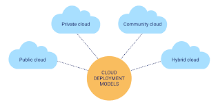

# Notes

## What is cloud computing?

 

+ Cloud computing is the delivery of computing services such as servers, storage, databases, networking, software, and analytics-over the internet ("the cloud").

***On-Demand Self-Service:***

+ Users can provision computing capabilities as needed automatically without requiring human interaction with each service provider.

***Broad Network Access:***

+ Services are accessible over the network and can be used from various devices (e.g., smartphones, tablets, PCs).

***Resource Pooling:***

+ Computing resources are pooled to serve multiple consumers using a multi-tenant model. Resources are dynamically assigned and reassigned according to demand.

***Rapid Elasticity:***

+ Resources can be scaled up or down quickly and elastically, providing a sense of infinite resources when needed.

### Benefits:

+ Cost Efficiency: Reduces the need for large capital expenditures on hardware and software.

+ Scalability: Easily scale resources up or down based on demand.

+ Accessibility: Access services and data from anywhere with an internet connection.

+ Disaster Recovery: Enhanced disaster recovery solutions and backups are often included.

### Challenges:

+ Security: Protecting sensitive data and ensuring privacy in the cloud can be complex.

+ Compliance: Meeting regulatory requirements for data protection can be challenging.

+ Downtime: Cloud service outages can impact service availability.

+ Vendor Lock-In: Difficulty in migrating services from one cloud provider to another.

## Cloud Computing Service Models

 

### ***1. Infrastructure as a Service (IaaS)***

**Definition:** 
+ Provides virtualized computing resources over the internet.

**Components:** 

+ Includes virtual machines, storage, networks, and operating systems.

**Control:** 

+ Users have control over the operating systems, storage, and deployed applications, but not the underlying hardware.

**Flexibility:** 

+ Highly scalable; users can rent resources on a pay-as-you-go basis.

**Examples:** 

+ Amazon Web Services (AWS) EC2, Microsoft Azure Virtual Machines, Google Compute Engine.

**Use Cases:**
+ Suitable for hosting websites, running applications, storing data, and creating development and test environments.

### ***2. Platform as a Service (PaaS)***

**Definition:** 

+ Delivers hardware and software tools over the internet, typically for application development.

**Components:** 

+ Provides a platform including operating systems, middleware, databases, and development tools.

**Control:** 

+ Users manage the applications and data but do not handle the underlying infrastructure or platform software.

**Development Focus:** 

+ Facilitates application development by offering pre-configured environments and tools.

**Examples:** 

+ Google App Engine, Microsoft Azure App Services, Heroku.

**Use Cases:** 

+ Ideal for developers building, deploying, and managing applications without worrying about the underlying hardware or operating system.

### ***3. Software as a Service (SaaS)***

**Definition:** 

+ Provides software applications over the internet on a subscription basis.

**Components:** 

+ End-user applications, including email, customer relationship management (CRM), and collaboration tools.

**Control:** 

+ Users only interact with the application and manage their data; the service provider manages the underlying infrastructure, platform, and application maintenance.

**Access:** 

+ Accessible via web browsers, often from any device with internet connectivity.

**Examples:** 

+ Google Workspace, Microsoft Office 365, Salesforce.

**Use Cases:** 

+ Ideal for end-users needing ready-to-use applications for communication, collaboration, and productivity.

## Cloud Computing Deployment Models

 

### 1. Public Cloud

***Description:*** 

+ Services are delivered over the internet and shared across multiple organizations.

***Characteristics:***

+ Scalability: Easily scale resources up or down based on demand.

+ Cost-Effective: Pay-as-you-go pricing model with no upfront investment.

+ Maintenance: AWS manages and maintains the infrastructure.

+ Examples: Amazon EC2, Amazon S3, Amazon RDS.

+ Use Cases: Suitable for a wide range of applications from web hosting to big data analytics and development/testing environments.

### 2. Private Cloud

***Description:*** 

+ Cloud infrastructure is dedicated to a single organization, either on-premises or hosted by a third-party provider.

***Characteristics:***

+ Control: Greater control over security and data privacy.

+ Customization: Tailored to meet specific business needs.

+ Cost: Can be more expensive due to hardware and management costs.

+ Examples: AWS Outposts (brings AWS services to your data center), AWS Local Zones.

+ Use Cases: Ideal for businesses with stringent regulatory or data privacy requirements, or those needing specialized hardware or configurations.

### 3. Hybrid Cloud

***Description:***

+ Combines public and private clouds, allowing data and applications to be shared between them.

***Characteristics:***

+ Flexibility: Leverages the benefits of both public and private clouds.

+ Integration: Requires seamless integration between on-premises infrastructure and cloud services.

+ Cost Efficiency: Balances between the cost of private cloud and the scalability of the public cloud.

+ Examples: AWS Direct Connect (for private connectivity to AWS), AWS Storage Gateway (integrates on-premises storage with cloud storage).

+ Use Cases: Suitable for businesses needing a balance between on-premises and cloud resources, such as disaster recovery, data backup, or regulatory compliance scenarios.

### 4. Community Cloud

***Description:*** 

+ Shared infrastructure for a specific community with common interests, managed either by organizations within the community or by a third-party provider.

***Characteristics:***

+ Shared Resources: Resources are shared among several organizations with similar needs.

+ Collaboration: Facilitates collaboration and information sharing within the community.

+ Cost Sharing: Costs are shared among the participating organizations.

+ Examples: AWS doesn’t have a direct community cloud service but allows for shared environments via VPC (Virtual Private Cloud) setups and Resource Access Manager.

+ Use Cases: Suitable for government agencies, healthcare organizations, or educational institutions that need to share resources and data while maintaining some level of privacy and control.

## AWS Global Infrastructure

### AWS Global Infrastructure

+ AWS is a cloud computing platform which is globally available.

+ Global infrastructure is a region around the world in which AWS is based. Global infrastructure is a bunch of high-level IT services which is shown below:

+ The following are the components that make up the AWS infrastructure:

    +       Availability Zones
    +  Region
    +  Edge locations
    +  Regional Edge Caches

### 1. Availability zone as a Data Center

+ An availability zone is a facility that can be somewhere in a country or in a city. Inside this facility, i.e., Data Centre, we can have multiple servers, switches, load balancing, firewalls. The things which interact with the cloud sits inside the data centers.

+ An availability zone can be a several data centers, but if they are close together, they are counted as 1 availability zone.

### 2. Region

+ A region is a geographical area. Each region consists of 2 more availability zones.

+ A region is a collection of data centers which are completely isolated from other regions.

+ A region consists of more than two availability zones connected to each other through links.

### 3. Edge Locations

+ Edge locations are the endpoints for AWS used for caching content.

+ Edge locations consist of CloudFront, Amazon's Content Delivery Network (CDN).

+ Edge locations are more than regions. Currently, there are over 150 edge locations.

+ Edge location is not a region but a small location that AWS have. It is used for caching the content.

+ Edge locations are mainly located in most of the major cities to distribute the content to end users with reduced latency.

### 4. Regional Edge Cache

+ AWS announced a new type of edge location in November 2016, known as a Regional Edge Cache.

+ Regional Edge cache lies between CloudFront Origin servers and the edge locations.

+ A regional edge cache has a large cache than an individual edge location.

+ Data is removed from the cache at the edge location while the data is retained at the Regional Edge Caches.
