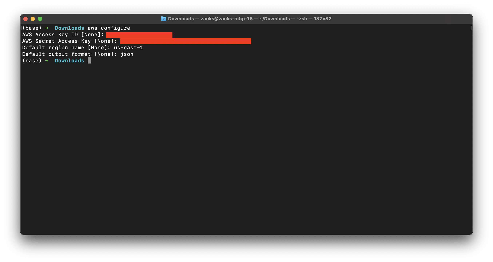
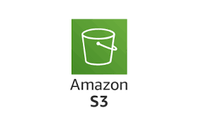

# Notes

## Aws-Cli




### AWS CLI Access

### What is AWS CLI?

+ AWS Command Line Interface (CLI) is a unified tool to manage AWS services from the command line.

+ Installation:

+  Installable on various platforms (Windows, macOS, Linux) via package managers or downloadable installers.

```sh
sudo apt-get update
```

```sh
sudo apt-get install awscli
```

```sh
aws --version
```


### Configuration:

+ Use aws configure command to set up access keys, secret keys, region, and output format.

```sh
aws configure
```

+ configuration:

    + Access Key ID: Your AWS access key.
    + Secret Access Key: Your AWS secret access key.
    + Default region name: E.g., us-west-2.
    + Default output format: E.g., json.


### Authentication:

+ Access to AWS services is managed through IAM (Identity and Access Management) roles and policies.

### Commands:

+ Allows you to execute commands to manage AWS resources (e.g., S3, EC2, IAM) using simple syntax.

### Scripting:

+ AWS CLI commands can be integrated into scripts for automation and efficient resource management.

### Output Formats:

+ Supports JSON, text, and table formats for command outputs, allowing for easier parsing and readability.


## S3 in Aws



<br>

### What is Amazon S3?

+ Amazon Simple Storage Service (Amazon S3) is a scalable object storage service provided by Amazon Web Services (AWS). It allows users to store and retrieve any amount of data from anywhere on the web. S3 is designed to offer high durability, availability, and scalability.

### Key Features of Amazon S3

***Scalability:***


+ Automatic Scaling: S3 automatically scales to handle growing amounts of data. You don't need to provision or manage storage capacity.

+ High Capacity: Can store an unlimited amount of data and objects.

***Durability:***

+ High Durability: S3 is designed for 99.999999999% (11 9's) durability over a given year. Data is redundantly stored across multiple facilities.

***Availability:***

+ High Availability: S3 provides high availability with a service level agreement (SLA) of 99.9% uptime.

***Data Security:***


+ Access Control: You can set permissions and access controls at both the bucket and object levels using policies, bucket ACLs (Access Control Lists), and IAM (Identity and Access Management) roles.

+ Encryption: Supports server-side encryption (SSE) for data at rest and SSL/TLS for data in transit.

***Data Management:***


+ Lifecycle Policies: Automatically manage objects through policies that move data between different storage classes or delete it after a specified period.

+ Versioning: Keep multiple versions of an object, allowing you to recover from unintended overwrites or deletions.

***Cost Efficiency:***

+ Storage Classes: Offers different storage classes such as Standard, Intelligent-Tiering, One Zone-IA (Infrequent Access), Glacier, and Glacier Deep Archive, each with different cost structures based on access patterns and data retrieval needs.


### Common Uses of Amazon S3

**1. Backup and Restore:**

+ Use S3 for backup and archival storage solutions. It’s commonly used for storing backup data and disaster recovery plans.

**2. Data Archiving:**

+ Archive data that is infrequently accessed but needs to be preserved, such as historical data or compliance-related records.

**3. Big Data Analytics:**

+ Store large datasets for analysis using tools like Amazon Athena, Amazon Redshift Spectrum, or Hadoop.

**4. Content Distribution:**

+ Serve static web content, such as images, videos, and documents, often integrated with content delivery networks (CDNs) like Amazon CloudFront.

**5. Application Data:**

+ Store application data, logs, and files in a scalable and cost-effective way.

**6. Disaster Recovery:**

+ Implement disaster recovery strategies by storing copies of critical data in geographically dispersed S3 buckets.

