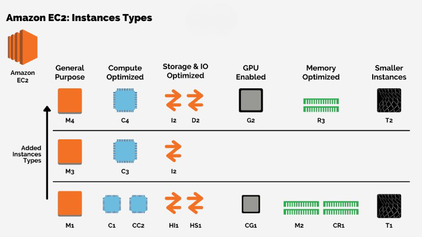
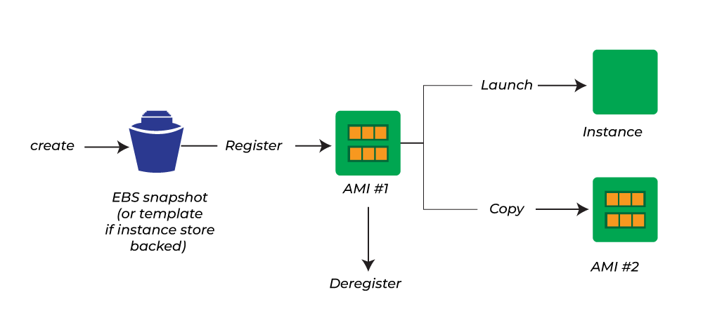

# Notes

# EC2 in AWS

### 1. Definition

**Amazon EC2:** 

+ A web service that provides resizable compute capacity in the cloud, allowing you to run virtual servers (instances) on-demand.

### 2. Instance Types

**General Purpose:** 

+ Balanced compute, memory, and network resources (e.g., t3, m5).

**Compute Optimized:** 

+ High-performance processors for compute-intensive tasks (e.g., c5).

**Memory Optimized:** 

+ More memory for large datasets and in-memory applications (e.g., r5, x1e).

**Storage Optimized:** 

+ High, sequential read and write access (e.g., i3, d2).

**Accelerated Computing:** 

+ Instances with GPU or FPGA for compute-heavy tasks like machine learning (e.g., p4, g4).

### 3. Launch Configuration

**Choosing AMI (Amazon Machine Image):** 

+ A pre-configured template for your instance, including the operating system, application server, and applications.

**Instance Type Selection:**
+ Choose based on your compute, memory, and storage requirements.

**Configuration:** 

+ Configure instance details such as network, IAM role, monitoring, and shutdown behavior.

**Storage:**
+ Attach EBS (Elastic Block Store) volumes or use instance store volumes.

**Security Group:** 
+ Define firewall rules to control traffic to your instance.

**Key Pair:** 

+ Provide a key pair for SSH access to your instance.

### 4. Pricing

+ On-Demand: Pay for compute capacity by the hour or second with no long-term commitments.

+ Reserved Instances: Commit to using EC2 for 1 or 3 years to receive a discount.

+ Spot Instances: Bid for unused EC2 capacity at reduced rates, with the possibility of interruption.

+ Savings Plans: Flexible pricing model that provides savings over on-demand rates with commitment to a certain amount of usage.

### 5. Security

+ Security Groups: Virtual firewalls that control inbound and outbound traffic.

+ Network ACLs: Subnet-level firewalls to provide an additional layer of security.

+ IAM Roles: Assign roles to EC2 instances for secure access to AWS services.

+ Encryption: Data encryption at rest (EBS volumes) and in transit (SSL/TLS).

### 6. Elasticity and Scaling

+ Auto Scaling: Automatically adjust the number of instances based on demand.

+ Load Balancing: Distribute incoming traffic across multiple instances for improved availability and fault tolerance (e.g., Elastic Load Balancer).

### 7. Monitoring and Management

+ CloudWatch: Monitor instance performance and set alarms for metrics like CPU utilization, disk I/O, and network traffic.

+ AWS Systems Manager: Manage and automate administrative tasks on your instances.

### 8. Storage Options

+ EBS (Elastic Block Store): Persistent block storage volumes attached to instances.

+ Instance Store: Temporary storage that is physically attached to the host machine.

+ Amazon S3: Object storage for backup and data archival.

### 9. Networking

+ VPC (Virtual Private Cloud): Create a private network within AWS to host your instances.

+ Elastic IP: Static IP addresses that can be associated with instances.

### 10. High Availability and Fault Tolerance

+ Availability Zones: Deploy instances across multiple data centers to increase fault tolerance.

+ Snapshots: Create backups of EBS volumes that can be restored or used to create new volumes.

### 11. Instances States

+ Running: The instance is active and operational.

+ Stopped: The instance is shut down but can be restarted; you are not billed for instance usage while it's stopped.

+ Terminated: The instance is deleted and cannot be recovered.

### 12. Common Use Cases

+ Web Hosting: Host websites and web applications.

+ Application Hosting: Run applications and services in the cloud.

+ Big Data: Process and analyze large datasets.

+ Development and Testing: Create development and test environments.

 

## Types of EC2 Instance

 

## 1. General Purpose Instances

**Purpose:** 

+ Provide a balanced mix of compute, memory, and networking resources.

**Use Cases:** 
+ Web servers, application servers, small databases, and development/testing environments.

**Types:**

**T Series** 
(e.g., t4g, t3, t3a)

**Features:**

+ Burstable performance, cost-effective.

**Best For:** 

+ Applications with variable workloads.

**M Series** 

+ (e.g., m6i, m5, m5a, m5n):

**Features:**
+ Balanced compute, memory, and network resources.

**Best For:**
+ General-purpose applications requiring a balance of resources.

### 2. Compute Optimized Instances

**Purpose:**
+ Provide high-performance processors for compute-intensive tasks.

**Use Cases:**

+ Batch processing, gaming, high-performance web servers.

**Types:**

+ C Series (e.g., c7g, c6i, c6a, c5):

**Features:**

+ High CPU-to-memory ratio, enhanced networking.

**Best For:**

+ CPU-bound applications, data analytics.

### 3. Memory Optimized Instances

**Purpose:**
+ Provide more memory relative to compute resources for applications requiring high memory.

**Use Cases:**

+ Large databases, memory-intensive applications.

**Types:**
+ R Series (e.g., r6g, r5, r5a, r5n):

**Features:** 
+ High memory capacity, high network bandwidth.

**Best For:**
+ High-performance databases, in-memory caches.

+ X Series (e.g., x1e, x1, x2gd):

**Features:**

+ Extreme memory capacity.

**Best For:** 

+ High-performance databases, big data applications.

### 4. Storage Optimized Instances

**Purpose:**

+ Provide high, sequential read and write access to large datasets.

**Use Cases:**

+  Data warehousing, distributed file systems, high-throughput data processing.

**Types:**

+ I Series (e.g., i4i, i3, i3en):

**Features:**

+ Local NVMe storage, high IOPS.

**Best For:**

+ Applications requiring high random I/O performance.
+ D Series (e.g., d2):

**Features:**

+ Dense storage with high throughput.

**Best For:**

+ Data-intensive applications with large data sets.

### 5. Accelerated Computing Instances

**Purpose:**
+ Provide hardware acceleration for compute-intensive tasks such as machine learning and scientific simulations.

**Use Cases:**

+ Machine learning inference, high-performance computing (HPC), graphics processing.

**Types:**

**P Series (e.g., p4, p3):**

+ Features: GPUs (NVIDIA Tesla) for ML and AI workloads.

+ Best For: Training and inference of deep learning models.

**G Series (e.g., g5, g4ad):**

+ Features: GPUs for graphics-intensive applications.

+ Best For: Graphics rendering, video encoding.

**Inf Series (e.g., inf1):**

+ Features: AWS Inferentia chips optimized for deep learning inference.

+ Best For: High-throughput, low-latency inference.

### 6. Bare Metal Instances

**Purpose:** 
+ Provide direct access to physical servers for specialized workloads.

**Use Cases:** 
+ Applications requiring direct hardware access, compliance requirements.

**Types:**

**M Series (e.g., m5.metal):**

+ Features: Full access to the underlying hardware.

+ Best For: Applications requiring non-virtualized environments.

### 7. High Performance Computing (HPC) Instances

**Purpose:** 

+ Designed for HPC workloads that require high performance.

**Use Cases:** 

+ Simulations, financial modeling, scientific research.

**Types:**

**HPC Instances** 

+ (e.g., hpc6id):

**Features:** 

+ Optimized for high performance and low latency.

**Best For:** 

+ Large-scale simulations and computations.

### Instance Family Characteristics

+ Compute: Number and power of CPUs.

+ Memory: Amount of RAM.

+ Storage: Type and size of storage (EBS or instance store).

+ Networking: Network bandwidth and features like enhanced networking.

## What is Amazon Machine Image (AMI)?

 
 

+ An Amazon Machine Image is a special type of virtual appliance that is used to instantiate (create) a virtual machine within EC2. 

+ It serves as the basic unit of deployment for services delivered using EC2. 

+ Whenever you want to launch an instance, you need to specify AMI. To launch instances, you can also use different AMIs. 

+ If you want to launch multiple instances from a single AMI,  then you need multiple instances of the same configuration.

### Properties of AMI

+ A template for the root volume for the instance (for example, an operating system, an application server, and applications)    

+ Launch permissions that control which AWS accounts can use the AMI to launch instances.

+ A block device mapping that specifies the volumes to attach to the instance when it’s launched

+ When you want to use AMI, select the following characteristics:-  

### Regions

+ Permission for launching AMI 

+ Operating System 

+ Root device Storage   

+ Architecture 

### Use an AMI

+ You can create your own customized AMI from an existing ec2-instance with the help of snapshots. 

+ After creating a snapshot you create a new ec2-instance by using the existing one know the new instance is the copy of an existing instance with all the required data in it. 

### Why do We Need AMI? 

+ Let us suppose that we want to launch 5 servers with the same configuration. 

+ One way of doing that would be to launch a new EC2 instance every time and install the required packages every time. 

+ While the other way of doing it would be to configure your EC2 instance once and then create an image of that instance. 

+ Using that image you can deploy four more EC2 servers