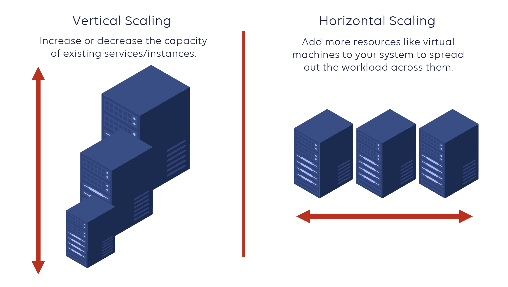
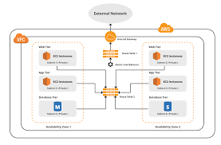

# Notes:

## Auto-Scaling

### AWS Auto Scaling

+ AWS auto-scaling is used to scale up and scale down the EC2-instance by depending on the incoming traffic. 

+ You can scale up and scale down the applications in a few minutes based on the traffic which will decrease the latency of the application to the end-users. 

+ You can integrate the AWS Auto Scaling with multiple services provided by AWS like Amazon traffic, Amazon DynamoDB and Amazon Aurora. 

+ You can also decrease the cost of an application because of dynamic scaling. 

+ When there is traffic, only maximum resources are used other it will use minimum resources.

### Benefits of Auto Scaling

**Dynamical scaling:** 

+ AWS auto-scaling service doesn’t require any type of manual intervention it will automatically scale the application down and up by depending up on the incoming traffic.

**Pay For You Use:** 
+ In auto scaling the resource will be utilised in the optimised way where the demand is low the resource utilisation will be low and the demand will high the resource utilisation will increase so the AWS is going to charge you only for the amount of resources you really used.

**Automatic Performance Maintenance:** 

+ AWS auto scaling maintains the optimal application performance with considering the workloads it will ensures that the application is running to desired level which will decrease the latency and also the capacity will be increased by based on your application

### What is Amazon EC2 Auto Scaling?

+ Amazon EC2 auto-scaling will helps you to scale the resources of EC2 depending on the demand of incoming traffic. It will maintain the high availability and optimize the cost of AWS EC2.

+ EC2 Auto Scaling is will helps to create collection of EC2 instances called an Autoscaling group where load balancer will transfer the load to this instances. 

+ The minimum, maximum, and preferred capacity for your Auto Scaling group can then be specified. 

+ To keep instances running at the appropriate capacity, EC2 Auto Scaling will start and stop them automatically.

## Types Of AWS Autoscaling

 

### Vertical Autoscaling:

**Definition:**

+ Adjusts the resources of a single instance (e.g., CPU, RAM).

**Scale Up:**

+ Increase instance size or resources.

**Scale Down:**

+ Decrease instance size or resources.

**Use Case:**

+  Ideal for applications requiring more power on a single instance.

**Limitations:**

+ May involve downtime; limited by instance type choices.

### Horizontal Autoscaling:

**Definition:**

+ Adds or removes instances in a fleet to handle load.

**Scale Out:**

+ Increase the number of instances.

**Scale In:**

+ Decrease the number of instances.

**Use Case:**

+ Ideal for distributed applications or load balancing.

**Benefits:**

+ Improves availability and fault tolerance; can handle large volumes of traffic.

## VPC in AWS

 

### What is AWS VPC?

+ Amazon Web Services (AWS) Virtual Private Cloud (VPC) is a service that allows users to create and manage their own virtual private network (VPN) in the AWS cloud. 

+ This allows users to have complete control over their own network environment, including the ability to select their own IP address range, create subnets, and configure route tables and network gateways.

+ One of the main benefits of using VPC is the ability to securely connect to the internet and to other AWS services. 

+ With VPC, users can create a public-facing subnet for their web servers, and a private-facing subnet for their databases. This allows for better security and isolation of sensitive data.

### Amazon VPC (Virtual Private Cloud) Components

**VPC**

+ You can launch AWS resources into a defined virtual network using Amazon Virtual Private Cloud (Amazon VPC). With the advantages of utilizing the scalable infrastructure of AWS, this virtual network closely mimics a conventional network that you would operate in your own data center. /16 user-defined address space maximum (65,536 addresses)

**Subnetes**

+ To reduce traffic, the subnet will divide the big network into smaller, connected networks. Up to /16, 200 user-defined subnets.

**Route Tables**

+ Route Tables are mainly used to Define the protocol for traffic routing between the subnets.

**Network Access Control Lists**

+ Network Access Control Lists (NACL) for VPC serve as a firewall by managing both inbound and outbound rules. There will be a default NACL for each VPC that cannot be deleted.

**Internet Gateway(IGW)**

+ The Internet Gateway (IGW) will make it possible to link the resources in the VPC to the Internet.

**Network Address Translation (NAT)**
 
+ Network Address Translation (NAT) will enable the connection between the private subnet and the internet.

### Use cases of Amazon VPC

+ Using VPC, you can host a public-facing website,  a single-tier basic web application, or just a plain old website.

+ The connectivity between our web servers, application servers, and database can be limited by VPC with the help of VPC peering. 

+ By managing the inbound and outbound connections, we can restrict the incoming and outcoming security of our application.
