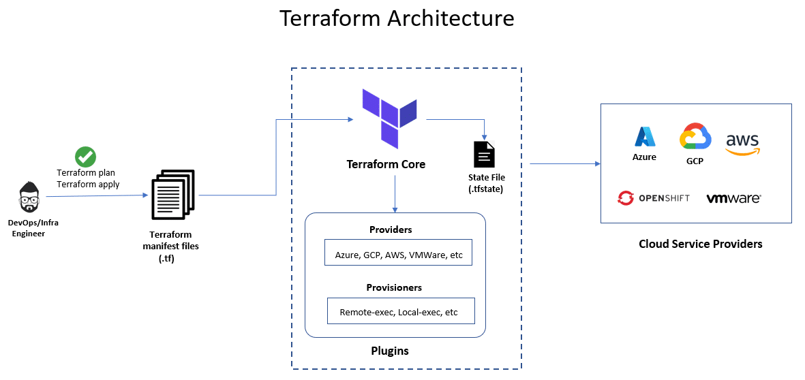

# Notes:

## Terraform Overview

+ Terraform is an open-source infrastructure as code (IaC) tool created by HashiCorp. It allows users to define and provision infrastructure using a high-level configuration language known as HashiCorp Configuration Language (HCL) or JSON. 

+ Terraform enables you to automate the creation, modification, and destruction of infrastructure resources across various cloud providers and on-premises environments, ensuring that infrastructure is managed consistently.

## Architecture of Terraform



**Configuration Files:**

+ Written in HashiCorp Configuration Language (HCL) or JSON.

+ Define the desired state of infrastructure.

+ Contain resources, providers, variables, and outputs.

**Providers:**

+ Plugins that interact with cloud platforms or services (e.g., AWS, Azure, Google Cloud).

+ Responsible for creating, reading, updating, and deleting resources.

+ Each provider has its own configuration and API interactions.

**Resources:**

+ Core building blocks defined in configuration files.

+ Represent infrastructure components like VMs, databases, or networking elements.

+ Defined by provider-specific types and attributes.

**Modules:**

+ Reusable and shareable components that encapsulate a set of resources.

+ Can be used to create complex infrastructure patterns.

+ Facilitates modular and organized configuration.

**State Management:**

+ Terraform maintains a state file (terraform.tfstate) to keep track of infrastructure.

+ Stores metadata about resources, their current state, and mappings to configuration.

+ Supports operations like planning and applying changes based on state.

**Backend:**

+ Responsible for storing and managing the state file.

+ Can be local (e.g., local file system) or remote (e.g., S3, Terraform Cloud).

+ Supports state locking to prevent concurrent modifications.

**Execution Plan:**

+ Generated by terraform plan command.

+ Shows the proposed changes to infrastructure based on the current state and configuration.

+ Helps review and validate changes before applying them.

**Apply:**

+ Executed with terraform apply to make changes to infrastructure.

+ Applies changes based on the execution plan and updates the state file.


**Variables:**

+ Used to parameterize configurations.

+ Can be defined in configuration files, passed via CLI, or loaded from environment variables.

+ Provides flexibility and customization for different environments.

**Outputs:**

+ Expose information about resources created by Terraform.

+ Useful for passing data between modules or extracting information for use elsewhere.

**Workspaces:**

+ Provide a way to manage multiple states and environments (e.g., dev, staging, prod).

+ Allow isolation and management of separate instances of infrastructure.

+ This architecture ensures that Terraform can effectively manage infrastructure as code, offering a declarative approach to provisioning and maintaining cloud resources.


### CLI Commands:

+ Terraform provides a set of command-line interface (CLI) commands to interact with its functionality:
    
    + terraform init: Initializes a Terraform working directory, downloading necessary plugins.
    
    + terraform plan: Creates an execution plan by comparing the current state with the desired state defined in the configuration files.
    
    + terraform apply: Applies the changes required to reach the desired state.
    
    + terraform destroy: Destroys the infrastructure managed by Terraform.


### Terraform installation steps

```bash
sudo apt-get update
```

```bash
wget -O- https://apt.releases.hashicorp.com/gpg | sudo gpg --dearmor -o /usr/share/keyrings/hashicorp-archive-keyring.gpg
```

```bash
echo "deb [signed-by=/usr/share/keyrings/hashicorp-archive-keyring.gpg] https://apt.releases.hashicorp.com $(lsb_release -cs) main" | sudo tee /etc/apt/sources.list.d/hashicorp.list
```

```bash
sudo apt update && sudo apt install terraform
```