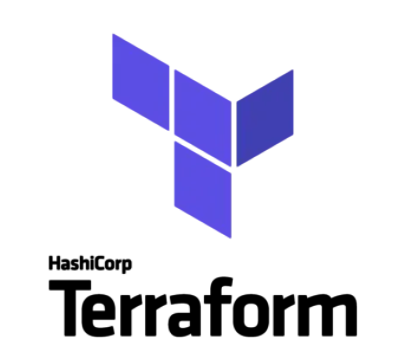

# Notes

## What is Terraform and Why Terrafrom

### What is Terraform?

**Infrastructure as Code (IaC):**

+ Terraform allows you to define your infrastructure (servers, databases, networks, etc.) in code. This code is written in HashiCorp Configuration Language (HCL) or JSON.

**Provider-Agnostic:**

+ It supports a wide range of cloud providers (like AWS, Azure, Google Cloud) and other services (like Kubernetes, Docker), allowing for a unified way to manage diverse environments.

**Declarative Configuration:**

+ You describe the desired state of your infrastructure, and Terraform takes care of making the necessary changes to reach that state.

**State Management:**

+ Terraform keeps track of the state of your infrastructure in a state file, which allows it to determine what changes need to be applied to reach the desired configuration.

**Execution Plans:**

+ Terraform generates an execution plan that shows what changes it will make before applying them. This helps you understand the impact of changes before they are made.

**Modular and Reusable:**

+ Terraform configurations can be broken down into modules, making it easier to reuse code and manage complex setups.

### Why Use Terraform?

**Consistency:**

+ Terraform ensures that infrastructure is deployed consistently across different environments. The same configuration code can be used to replicate environments accurately.

**Version Control:**

+ Since Terraform configurations are text files, they can be stored in version control systems (like Git). This enables tracking changes, rolling back to previous versions, and collaborating with team members.

**Automated Provisioning:**

+ Automates the process of provisioning infrastructure, reducing manual errors and accelerating deployment times.

**Infrastructure Management:**

+ Makes it easier to manage and update infrastructure. Changes can be planned and applied in a controlled manner, ensuring that the infrastructure evolves in a predictable way.

**Multi-Cloud and Hybrid Cloud:**

+ Supports managing resources across multiple cloud providers and on-premises systems from a single platform.

**Resource Optimization:**

+ Helps optimize resources by allowing for easy scaling and adjustments based on the desired state defined in the configuration.

**Improved Collaboration:**

+ Teams can work together using shared configurations and state files, facilitating better coordination and knowledge sharing.

**Cost Management:**

+ By using IaC principles, you can manage and track infrastructure costs more effectively, as changes and resource allocations are more transparent and controlled.

 

