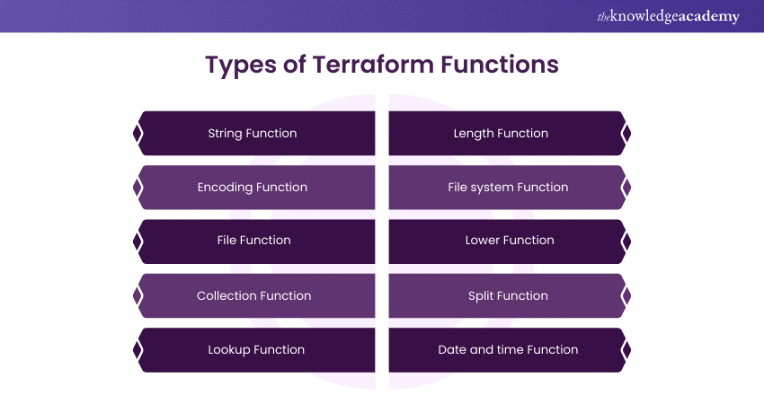

# Remaining Notes:

## State Management


### 1. What is Terraform State?

**Definition:**

+ A file that stores information about the resources managed by Terraform, including their current configuration and metadata.
Purpose: Keeps track of the infrastructure’s state so that Terraform can detect changes and apply updates correctly.

### 2. State File (terraform.tfstate):

**Location:**

+ By default, Terraform stores the state file locally in the working directory.
Format: Typically a JSON file containing the current state of the resources.
Security: Should be protected because it contains sensitive information, such as resource IDs and metadata.

### 3. Remote State Storage:

**Definition:**

+ Storing the state file in a remote backend rather than locally.

### Benefits:


+ Collaboration: Allows multiple team members to work with Terraform simultaneously.

+ Durability: Ensures the state file is not lost due to local machine failure.

+ Locking: Prevents simultaneous state modifications that could corrupt the state file.

+ Common Backends:

+ S3 (AWS): Often used with DynamoDB for state locking.

+ Azure Storage: For storing state in Azure Blob Storage.

+ Google Cloud Storage (GCS): For use with Google Cloud Platform.

+ Terraform Cloud/Enterprise: Offers advanced features like state locking, versioning, and collaboration.

### 4. State Locking:

**Purpose:**

+ Prevents concurrent operations from corrupting the state file.

**How it Works:**

+ When a Terraform operation starts, it acquires a lock on the state file. Other operations must wait until the lock is released.

+ Backends Supporting Locking: S3 with DynamoDB, Azure Storage, GCS, and Terraform Cloud/Enterprise.

### 5. State Versioning:

**Purpose:**

+ Keeps track of changes and allows rollback to previous states if needed.

**Automatic:**

+ Some backends like Terraform Cloud automatically version states.

**Manual:**

+ For local state files, manual versioning requires additional processes, such as backup copies.

### 6. State Management Commands:

+ terraform init: Initializes the working directory and configures the backend.

+ terraform refresh: Updates the state file with the real-world state of resources.

+ terraform state list: Lists resources tracked in the state file.

+ terraform state show <resource>: Shows detailed information about a specific resource in the state.

+ terraform state rm <resource>: Removes a resource from the state without destroying it.

+ terraform state mv <source> <destination>: Moves a resource within the state file.

7. State File Manipulation:

**Manual Editing:**

+  Not recommended unless absolutely necessary. Incorrect edits can lead to corrupted state.

**Use Cases:**

+ Advanced operations like renaming resources or handling drift.

### 8. Handling State Drift:

**Definition:**

+ When the actual state of resources differs from the state file.

**Detection:**

+ Can be identified by running terraform plan, which compares the state file with the real-world infrastructure.

**Resolution:**

+ Requires applying the plan to bring the state file and actual infrastructure back into sync.


<hr>

## Functions in Terraform



<br>

### length()

**Description:**

+ Returns the number of elements in a list or the number of characters in a string.

+ Example:
```hcl
variable "my_list" {
  default = ["a", "b", "c"]
}

output "list_length" {
  value = length(var.my_list)  # Outputs 3
}
```

### concat()

**Description:**

+  Joins two or more lists into a single list.

+ Example:

```hcl
variable "list1" {
  default = ["a", "b"]
}

variable "list2" {
  default = ["c", "d"]
}

output "combined_list" {
  value = concat(var.list1, var.list2)  # Outputs ["a", "b", "c", "d"]
}
```

### join()

**Description:**

+ Combines a list of strings into a single string with a specified separator.

+ Example:

```hcl
variable "words" {
  default = ["hello", "world"]
}

output "joined_words" {
  value = join(" ", var.words)  # Outputs "hello world"
}
```

### split()

**Description:**

+ Splits a string into a list of substrings based on a separator.

+ Example:

```hcl
variable "sentence" {
  default = "hello world"
}

output "words_list" {
  value = split(" ", var.sentence)  # Outputs ["hello", "world"]
}
```

### upper()

**Description:**

+ Converts a string to uppercase.

+ Example:

```hcl
variable "text" {
  default = "hello"
}

output "uppercase_text" {
  value = upper(var.text)  # Outputs "HELLO"
}
```

### lower()

**Description:**

+ Converts a string to lowercase.
+ Example:

```hcl
variable "text" {
  default = "HELLO"
}

output "lowercase_text" {
  value = lower(var.text)  # Outputs "hello"
}
```

### trimspace()

**Description:**

+ Removes leading and trailing whitespace from a string.

+ Example:

```hcl
variable "text_with_spaces" {
  default = "  hello  "
}

output "trimmed_text" {
  value = trimspace(var.text_with_spaces)  # Outputs "hello"
}
```

### element()

**Description:**

+ Retrieves an element from a list by index.

+ Example:

```hcl
variable "colors" {
  default = ["red", "green", "blue"]
}

output "second_color" {
  value = element(var.colors, 1)  # Outputs "green"
}
```

### lookup()

**Description:**

+ Retrieves a value from a map by key. Can specify a default value if the key does not exist.

+ Example:

```hcl
variable "config" {
  default = {
    "port" = 80
    "host" = "example.com"
  }
}

output "host_value" {
  value = lookup(var.config, "host", "default.com")  # Outputs "example.com"
}
```
### map()

**Description:**

+  Creates a map from given keys and values.

+ Example:

```hcl
output "my_map" {
  value = map("name", "Terraform", "type", "IaC")  # Outputs { "name" = "Terraform", "type" = "IaC" }
}
```

### merge()

**Description:**

+ Combines multiple maps into a single map.

+ Example:

```hcl
variable "map1" {
  default = {
    "a" = 1
    "b" = 2
  }
}

variable "map2" {
  default = {
    "b" = 3
    "c" = 4
  }
}

output "merged_map" {
  value = merge(var.map1, var.map2)  # Outputs { "a" = 1, "b" = 3, "c" = 4 }
}
```

<hr>

## Terraform Modules


### Types of Terraform Modules

1. Root Module
2. Child Module
3. Published Modules


### What does a module do?
+ By building logical abstraction on top of a resource set, you may use  modules in terraform. To put it another way, a module enables the grouping of resources for subsequent reuse—possibly repeatedly.

+ Assume we have a cloud-hosted virtual server with various functionalities. Which group of resources would best sum up that server? For instance:

    **1.** A virtual machine built from a picture

    **2.** A block device with a connected storage space that is a specific size.

    **3.** A public static IP address that is assigned to the server’s virtual network interface

    **4.** A set of firewall guidelines that should be attached to the server

    **5.** Other factors, such as an extra network interface or block device.


### Why Modules?

+ Organise Configuration: Easier to navigate, understand, and update your configuration
+ Encapsulate Configuration: Helps prevent unintended consequences
+ Re-use Configuration: Share modules that you have written with your team or the general public
+ Consistency: help to provide consistency in your configurations


+ Example lets create a module for VPC ,ec2 and security group


```css
modules/
├── vpc/
│   ├── main.tf
│   ├── variables.tf
│   └── outputs.tf
├── security_group/
│   ├── main.tf
│   ├── variables.tf
│   └── outputs.tf
└── ec2/
    ├── main.tf
    ├── variables.tf
    └── outputs.tf
```

```hcl
resource "aws_vpc" "main" {
  cidr_block           = "10.0.0.0/16"
  enable_dns_support   = true
  enable_dns_hostnames = true
  tags = {
    Name = "main-vpc"
  }
}
```
+ Move this into modules/vpc/main.tf, and adjust it to use variables:

```hcl
resource "aws_vpc" "this" {
  cidr_block           = var.cidr_block
  enable_dns_support   = var.enable_dns_support
  enable_dns_hostnames = var.enable_dns_hostnames
  tags = {
    Name = var.name
  }
}
```

### Use the Module in the Root Configuration
In your root configuration, use the modules you created. For example:

```hcl
module "vpc" {
  source              = "./modules/vpc"
  cidr_block          = "10.0.0.0/16"
  enable_dns_support  = true
  enable_dns_hostnames = true
  name                = "main-vpc"
}

module "security_group" {
  source    = "./modules/security_group"
  vpc_id    = module.vpc.vpc_id
  sg_name   = "main-sg"
  ingress_rules = [
    {
      from_port   = 80
      to_port     = 80
      protocol    = "tcp"
      cidr_blocks = ["0.0.0.0/0"]
    },
  ]
}

module "ec2" {
  source            = "./modules/ec2"
  ami               = "ami-0c55b159cbfafe1f0"
  instance_type     = "t2.micro"
  vpc_security_group_ids = [module.security_group.sg_id]
  subnet_id         = module.vpc.subnet_id
}
```

## Terraform Workspaces


### Terraform Workspaces

**Purpose:**


+ Manage multiple environments (e.g., development, staging, production) using the same configuration.

+ Keep state files separate for each environment to avoid conflicts and ensure isolation.

##### 1. Default Workspace:

+ default workspace is automatically created and used if no other workspace is specified.

##### 2. Creating Workspaces:

+ Use terraform workspace new <workspace_name> to create a new workspace.

##### Selecting Workspaces:

+ Use terraform workspace select <workspace_name> to switch between existing workspaces.

##### Listing Workspaces:

+ Use terraform workspace list to list all available workspaces.

##### Deleting Workspaces:

+ Use terraform workspace delete <workspace_name> to remove a workspace (ensure it's not the active workspace).

##### Workspace-Specific State:

+ Each workspace has its own state file, allowing for separate state management.
Usage:

+ Variables and configurations remain the same; only the state files differ.

##### Basic Example

### Initialize Terraform:

```sh
terraform init
```

### Create Workspaces:

```sh
terraform workspace new dev
terraform workspace new prod
```

### List Workspaces:

```sh
terraform workspace list
```

### Output might be:


```markdown
  * default
    dev
    prod
```

### Select Workspace:

```sh
terraform workspace select dev
```

### Apply Configuration:

+ Apply Terraform configurations in the selected workspace:

```sh
terraform apply
```
### Switch to Another Workspace:

```sh
terraform workspace select prod
```

### Delete a Workspace:

+ Ensure you're not in the workspace you want to delete:

```sh
terraform workspace select default
terraform workspace delete dev
```
### Considerations

+ Workspaces are not intended for complex multi-environment setups or for separating state files by different projects. For such use cases, consider using separate Terraform configurations or modules.

+ Changes to resources or configurations will only affect the currently selected workspace.

+ This structure allows you to manage environments effectively with Terraform by keeping their states isolated from one another.


<hr>

## create_before_destroy

**Purpose:**

+ Ensures that a new resource is created before the old one is destroyed. This is useful for avoiding downtime during resource replacement.

**Usage:**

+ Defined in a lifecycle block within a resource configuration.

### Syntax:

```hcl
resource "aws_instance" "example" {
  # resource configuration
  lifecycle {
    create_before_destroy = true
  }
}
```

### Behavior:


+ When create_before_destroy is set to true, Terraform will first create the new resource with the updated configuration.

+ Only after the new resource is successfully created, Terraform will destroy the old resource.

+ Useful for resources where disruption would be problematic, such as web servers or databases.

### Typical Use Cases:


+ When upgrading instances or services where you need to ensure continuity.

+ When replacing resources that should not be interrupted, like load balancers or application servers.

## prevent_destroy

**Purpose:**

+ Prevents the resource from being destroyed, even if it is removed from the Terraform configuration or replaced.

**Usage:**

+ Also defined in a lifecycle block within a resource configuration.

### Syntax:

```hcl
resource "aws_instance" "example" {
  # resource configuration
  lifecycle {
    prevent_destroy = true
  }
}
```

### Behavior:

+ When prevent_destroy is set to true, any plan that attempts to destroy this resource will fail.

+ Terraform will refuse to proceed with the destruction of the resource, providing a safeguard against accidental deletion.

### Typical Use Cases:

+ Protecting critical resources that should not be removed, such as production databases or vital infrastructure components.

+ Ensuring that resources are preserved even if there are changes in the configuration that might inadvertently lead to their deletion.

<hr>

## Terraform Provisioners: Local-Exec and Remote-Exec


## Local-Exec Provisioner

**Purpose:**

+ Runs commands on the local machine where Terraform is executed.

**Use Case:**

+ Useful for tasks that need to interact with the local environment, such as generating files or running scripts on the local machine.

**Execution:**

+ Executes on the local machine, not on the created infrastructure.

### Configuration:

**Command:**

+ Specify commands or scripts to execute.

### Example:

```hcl
provisioner "local-exec" {
  command = "echo 'Instance ID: ${aws_instance.example.id}' >> instance_info.txt"
}
```

**Requirements:**

+ No special connection settings needed; it runs directly on the local environment.

**Pros:**

+ Useful for local integration tasks; simple setup.

**Cons:**

+ Does not guarantee the resource creation was successful before executing; not suitable for 

+ configuring remote resources.

## Remote-Exec Provisioner

**Purpose:**

+ Executes commands directly on the created resource (e.g., VM) via SSH or WinRM.

**Use Case:**

+ Ideal for configuring or setting up the resource after its creation, such as installing software or applying configurations.

+ Execution: Executes on the resource that has been created by Terraform.

### Configuration:

+ Connection Settings: Requires SSH or WinRM connection details.
+ Inline Commands: Specify commands or scripts to run.

### Example:

```hcl
provisioner "remote-exec" {
  inline = [
    "sudo apt-get update",
    "sudo apt-get install -y nginx"
  ]
  connection {
    type        = "ssh"
    user        = "ubuntu"
    private_key = file("~/.ssh/id_rsa")
    host        = self.public_ip
  }
}
```

**Requirements:**

+ Requires proper connection configuration (SSH for Linux/Unix or WinRM for Windows).

**Pros:**

+ Directly configures the created resource; suitable for post-creation setup.

**Cons:**

+ More complex setup; requires connection to the resource; may not handle failures gracefully.


