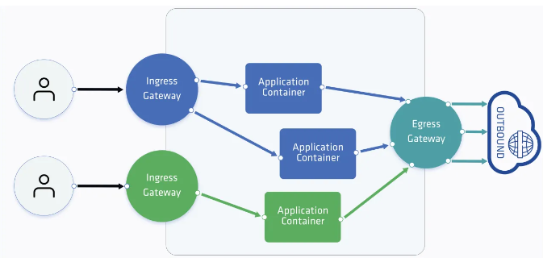
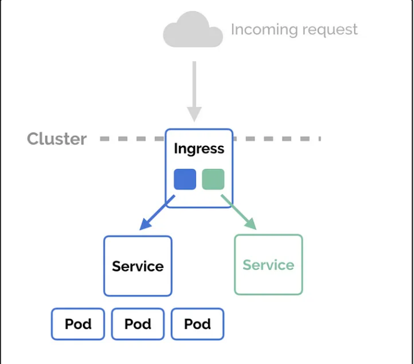
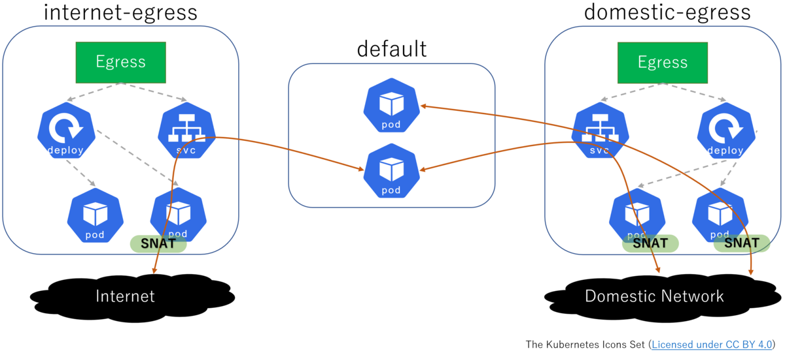
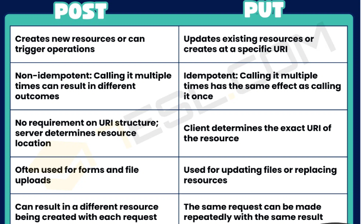
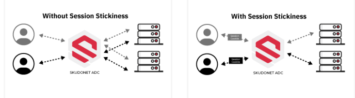

# Note 1

## Ingress and Egress in Kubernetes Networking




---


## Ingress





---

***Purpose: Enables external traffic to reach containers within a Kubernetes cluster.***

+ #### Components:

  + Ingress Controller: Acts as a load balancer to manage incoming traffic.

  + Ingress Resource: A Kubernetes object defining rules for routing traffic.


+ #### Functionality:

  + Routing Rules: Specifies how traffic should be directed based on hostnames, paths, and services.

  + Configuration: Ingress controller interprets the rules defined in the Ingress resource.

  + Load Balancing: Directs traffic to appropriate containers based on defined rules.

  + Usage: Commonly used to expose web applications, APIs, and services externally.

  + Flexibility: Supports routing based on hostnames (e.g., example.com), paths (e.g., /api), and services (e.g., backend service).

  + Implementation: Requires an Ingress controller deployment suitable for the cluster environment (e.g., NGINX Ingress Controller, Traefik).


### ***Example :***

```yml
apiVersion: networking.k8s.io/v1
kind: Ingress
metadata:
  name: frontend-ingress
spec:
  rules:
  - host: example.com
    http:
      paths:
      - path: /
        pathType: Prefix
        backend:
          service:
            name: frontend-service
            port:
              number: 80
```

### Explanation:

+ ***host:*** <br> Specifies the domain through which the service will be accessed.

+ ***http.paths:*** <br> Defines the routing rules based on URL paths.

+ ***backend.service:***<br> Specifies the backend service to which traffic will be routed.

---

## Egress



---

***Purpose: Allows containers in Kubernetes to communicate with external resources like databases, APIs, and services outside the cluster.***


+ #### Configuration:
  + Requires setting up network policies that explicitly permit outbound traffic from pods to external destinations.

+ #### Network Policy:

  + Kubernetes object defining rules for network traffic within the cluster.

  + Specifies which pods can communicate with each other internally and with external resources.

+ #### Enforcement:


  + Managed by Kubernetes network plugins which enforce the defined network policies.

  + Controls and monitors network connectivity between containers.

+ #### Common Usage:
  
  + Enables containers to access databases, APIs, and services hosted externally from the Kubernetes cluster.

### ***Example***

```yml
apiVersion: networking.k8s.io/v1
kind: NetworkPolicy
metadata:
  name: egress-network-policy
spec:
  podSelector: {}
  egress:
  - to:
    - ipBlock:
        cidr: 203.0.113.0/24
        except:
        - 203.0.113.10/32
    ports:
    - protocol: TCP
      port: 3306
```

### ***Explanation:***

+ ***to.ipBlock:*** Specifies the destination IP range that pods are allowed to access.

+ ***ports:*** Defines the ports and protocols allowed for outbound traffic.

<br>

# Note2

## Post vs put method used in ingress network policy


#### apiVersion: networking.k8s.io/v1

+ Specifies the API version of Kubernetes networking resources being used.

#### kind: Ingress

+ Defines that this YAML document describes an Ingress resource, which manages 
+ external access to services in a Kubernetes cluster.

#### metadata:

+ Contains metadata about the Ingress resource, including its name (example-ingress in this case).

#### annotations:

+ Additional configuration settings for the Ingress resource, specific to the NGINX Ingress controller.

#### nginx.ingress.kubernetes.io/server-snippet:

+ Specifies that the following configuration snippet should be injected into the NGINX server block for this Ingress resource.

#### location/ { ... }

+ Defines a location block within NGINX configuration. Here, / represents the root location.

```if ($request_method = POST) { ... }```

+ Condition that checks if the HTTP request method is POST.

```proxy_pass http://backend-service;```

+ Action taken if the condition ($request_method = POST) is true:

+ proxy_pass directs NGINX to forward requests to http://backend-service.

+ This implies that all POST requests to the root location (/) will be proxied to http://backend-service.

```if ($request_method = GET) { ... }```

+ Condition that checks if the HTTP request method is GET.

```proxy_pass http://frontgend-service;```

+ Action taken if the condition ($request_method = GET) is true:

+ proxy_pass directs NGINX to forward requests to http://frontgend-service.

+ This means that all GET requests to the root location (/) will be proxied to http://frontgend-service.

### Explanation of the Configuration:

***Purpose: This configuration snippet customizes how NGINX handles HTTP requests to the root location (/) of example-ingress.***

+ ####  Routing Logic:

  + POST Requests: Any HTTP POST requests ($request_method = POST) to / are redirected to http://backend-service.

  + GET Requests: Any HTTP GET requests ($request_method = GET) to / are redirected to http://frontgend-service.

+ #### Flexibility: 

  + Enables routing requests based on their HTTP method, which can be useful for directing different types of requests to appropriate backend services or microservices within the Kubernetes cluster.

+ #### Caution: 

  + Using conditional logic (if statements) in NGINX configuration can impact performance if not used judiciously. Ensure to validate and test such configurations in a staging environment before deploying to production.

### ***Example***

```yml

apiVersion: networking.k8s.io/v1
kind: Ingress
metadata:
 name: example-ingress

  annotations:
   nginx.ingress.kubernetes.io/server-snippet:
     location/{
    
        if($request_method = POST){
         proxy_pass http://backend-service;
        }
        if($request_method = GET){
         proxy_pass http://frontgend-service;
        }     
   }
  
  ...
```


## Difference





---


<br>

# Note 3


## Sticky Session




---

+ ### What are sticky sessions?

  + Sticky sessions, also known as session persistence, are a crucial aspect of load balancing for web applications. 

  + They ensure that user sessions are maintained consistently throughout their interaction with the application

  + In other words, once a user is directed to a specific server, all subsequent requests from that user are routed to the same server. 
  
  + It ensures a seamless and personalized experience for every single user


+ ### How the sticky session Work?

### Load Balancer Setup:

+ A web application utilizes a load balancer to distribute incoming requests across multiple backend servers.

+ The load balancer employs a predefined algorithm (like round-robin or least connections) to decide which server should handle each request.

### Initial Request Handling:

+ When a user makes an initial request to the web application, the load balancer checks for an existing session cookie in the request headers.

+ If no session cookie is present (indicating a new session or expired cookie), the load balancer directs the request to a backend server based on its load balancing algorithm.

### Session Cookie Generation:

+ The backend server that receives the request processes it and generates a session cookie.

+ This session cookie contains information (usually a unique session ID) that identifies the server handling the user’s session.
Subsequent Requests:

+ For subsequent requests from the same user, the browser automatically includes the session cookie in the request headers.

+ The load balancer uses this session cookie to determine which backend server originally handled the user’s session.

### Benefits and Use Cases:

1. ***Session Persistence:*** 
  
   Sticky sessions ensure that all requests from a user during a session are routed to the same backend server.

2. ***Stateful Operations:*** 
 
   This facilitates maintaining user-specific data such as shopping carts, user preferences, and login sessions without requiring repeated authentication.

3. ***Improved Performance:*** 

   Reduces the need for backend servers to synchronize session data across all servers, potentially improving performance and response times for users.

### Considerations:

1. ***Scalability:*** 
  
   While sticky sessions are useful, they can complicate horizontal scaling of applications since all requests for a session must go to a specific server.

2. ***Session Management:*** 
   
   Requires careful management of session timeouts, cookie security, and load balancer configurations to ensure smooth operation and security.
