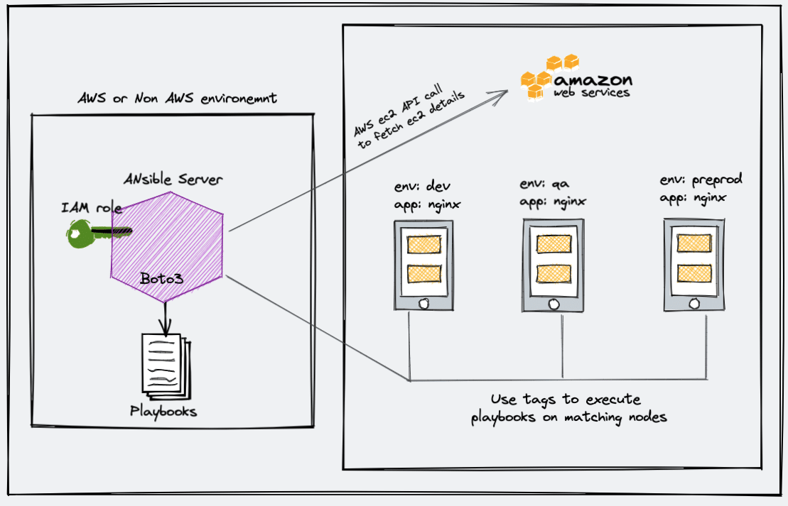

# Ansible Dynamic inventory using Ec2





## Note:

<h1><center>Setup Ansible AWS Dynamic Inventory</center></h1>

#### Aim: dynamic inventory on AWS using boto and the AWS ec2 Ansible plugin.

***Step 1:*** Ensure you have python3 & pip3 installed in your Ansible server.

+ validate it using the following command.

```bash
python3 --version
```

***Step 2:***  If you don’t have python3, you can install it using the following command.

```bash
sudo apt install python3 -y
sudo apt install python3-pip –y
```

***step 3:***Install the boto3 library. Ansible uses the boot core to make API calls to AWS to retrieve ec2 instance details.

```bash
sudo pip3 install boto3
```

***Step 4:*** Create an inventory directory under /opt and cd into the directory.

```bash
sudo mkdir -p /opt/ansible/inventory
cd /opt/ansible/inventory
```

***Step 5:*** Create a file named aws_ec2.yaml in the inventory directory.

```bash
sudo vi aws_ec2.yaml
```

+ If you are running an ansible server outside the AWS environment, replace add your AWS access key and secret to the config file.

```yml
---
plugin: aws_ec2
aws_access_key: <YOUR-AWS-ACCESS-KEY-HERE>
aws_secret_key: <YOUR-AWS-SECRET-KEY-HERE>
keyed_groups:
  - key: tags
    prefix: tag

```

+ If your ansible server is running inside the AWS environment, attach an ec2 instance role with the required AWS ec2 permissions (Mostly describe instances). This way you don’t have to add the access and secret key in the configuration. Ansible will automatically use the attached role to make the AWS API calls.


+ ***Step 6:*** Open /etc/ansible/ansible.cfg file.

```bash
sudo vi /etc/ansible/ansible.cfg
```

+ Find the [inventory] section and add the following line to enable the ec2 plugin.

```bash
enable_plugins = aws_ec2
```

+ It should look something like this.

```ini
[inventory]
enable_plugins = aws_ec2
```

+ ***Step 7:*** Now let’s test the dynamic inventory configuration by listing the ec2 instances.

```bash
ansible-inventory -i /opt/ansible/inventory/aws_ec2.yaml --list
```

+ The above command returns the list of ec2 instances with all its parameters in JSON format


+ If you want to use the dynamic inventory as a default Ansible inventory, edit the /etc/ansible/ansible.cfg file and search for inventory parameters under defaults. Change the inventory parameter value as shown below

```ini
inventory      = /opt/ansible/inventory/aws_ec2.yaml
```

+ Now if you run the inventory list command without passing the inventory file, Ansible looks for the default location and picks up the aws_ec2.yaml inventory file.

+ ***Step 8:*** Execute the following command to test if Ansible is able to ping all the machines returned by the dynamic inventory.

```bash
ansible all -m ping
```
