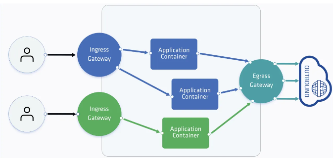
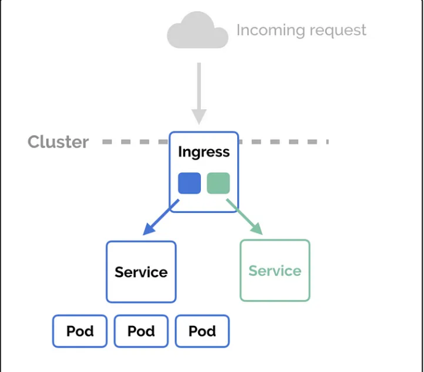
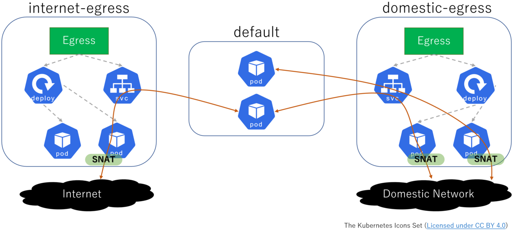

## Ingress and Egress in Kubernetes Networking




---


## Ingress





---

***Purpose: Enables external traffic to reach containers within a Kubernetes cluster.***

+ #### Components:

  + Ingress Controller: Acts as a load balancer to manage incoming traffic.

  + Ingress Resource: A Kubernetes object defining rules for routing traffic.


+ #### Functionality:

  + Routing Rules: Specifies how traffic should be directed based on hostnames, paths, and services.

  + Configuration: Ingress controller interprets the rules defined in the Ingress resource.

  + Load Balancing: Directs traffic to appropriate containers based on defined rules.

  + Usage: Commonly used to expose web applications, APIs, and services externally.

  + Flexibility: Supports routing based on hostnames (e.g., example.com), paths (e.g., /api), and services (e.g., backend service).

  + Implementation: Requires an Ingress controller deployment suitable for the cluster environment (e.g., NGINX Ingress Controller, Traefik).


### ***Example :***

```yml
apiVersion: networking.k8s.io/v1
kind: Ingress
metadata:
  name: frontend-ingress
spec:
  rules:
  - host: example.com
    http:
      paths:
      - path: /
        pathType: Prefix
        backend:
          service:
            name: frontend-service
            port:
              number: 80
```

### Explanation:

+ ***host:*** <br> Specifies the domain through which the service will be accessed.

+ ***http.paths:*** <br> Defines the routing rules based on URL paths.

+ ***backend.service:***<br> Specifies the backend service to which traffic will be routed.

---

## Egress



---

***Purpose: Allows containers in Kubernetes to communicate with external resources like databases, APIs, and services outside the cluster.***


+ #### Configuration:
  + Requires setting up network policies that explicitly permit outbound traffic from pods to external destinations.

+ #### Network Policy:

  + Kubernetes object defining rules for network traffic within the cluster.

  + Specifies which pods can communicate with each other internally and with external resources.

+ #### Enforcement:


  + Managed by Kubernetes network plugins which enforce the defined network policies.

  + Controls and monitors network connectivity between containers.

+ #### Common Usage:
  
  + Enables containers to access databases, APIs, and services hosted externally from the Kubernetes cluster.

### ***Example***

```yml
apiVersion: networking.k8s.io/v1
kind: NetworkPolicy
metadata:
  name: egress-network-policy
spec:
  podSelector: {}
  egress:
  - to:
    - ipBlock:
        cidr: 203.0.113.0/24
        except:
        - 203.0.113.10/32
    ports:
    - protocol: TCP
      port: 3306
```

### ***Explanation:***

+ ***to.ipBlock:*** Specifies the destination IP range that pods are allowed to access.

+ ***ports:*** Defines the ports and protocols allowed for outbound traffic.

