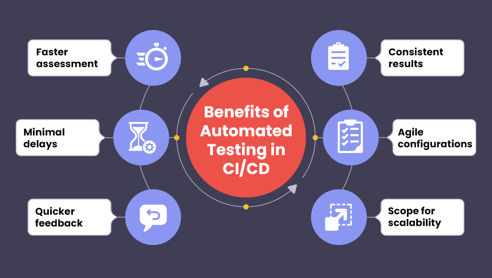
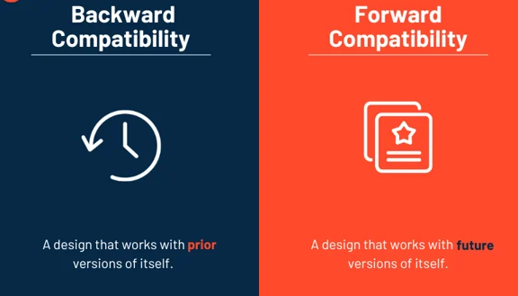
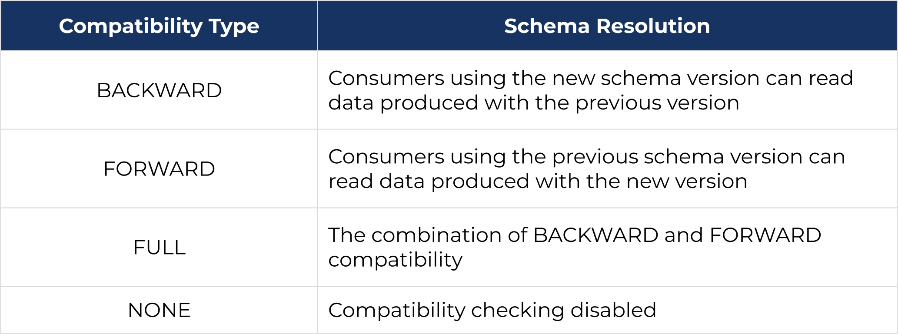

# Notes 1 : 

## QA Pipeline

 

---

+ ***Checkout:*** This stage involves fetching the source code from a repository.

+ ***Build***  In this stage, the code is compiled and built into an executable or a package.

+ ***Test:*** This stage involves running various tests on the built code, such as unit tests, integration tests, and functional tests.

+ ***Deploy:*** In this stage, the code is deployed to a production or a staging environment.

+ Each of these stages can be further broken down into smaller steps, depending on the complexity of the project. Additionally, Jenkins pipelines can be configured to automatically trigger the next stage based on the success or failure of the previous stage, ensuring a smooth and automated QA pipeline.

+ ###  Here are some additional details on each stage:

 + ***Checkout:*** Jenkins can be configured to automatically check out the latest version of the code from a repository, such as Git or SVN. This can be done using plugins like the Git plugin or the Subversion plugin.

 + ***Build:*** The build stage involves compiling the code and creating an executable or a package. This can be done using tools like Maven, Gradle, or Ant. Jenkins can be configured to automatically build the code using these tools, and can also be configured to run build-time tests.

 + ***Test:*** The test stage involves running various tests on the built code. This can include unit tests, integration tests, and functional tests. Jenkins can be configured to run these tests automatically, and can also be configured to generate test reports.

  + ***Deploy:*** The deploy stage involves deploying the code to a production or a staging environment. This can be done using tools like Ansible, Chef, or Puppet. Jenkins can be configured to automatically deploy the code, and can also be configured to run post-deployment tests.

# Notes 2 :

 

---

***Backward Compatibility***

+ The current version of code can work with a higher version of the tool installed.

+ Example - Code built on 2.5 can work with any version later than 2.5 of that tool.

***Forward Compatibility***

+ The current version of code can work with a lower version of the tool installed.

+ Example - Code built on 3.0 can work with any version later than 2.5 of that tool.

 

---

 

+ The three primary compatibility modes are backwards, which is the default setting, forward, and full.

+ With all three of these modes, the associated test verifies the compatibility of a schema being registered with its immediate predecessor.

 

+ ***Notes:*** that it is also possible to set the compatibility mode to none which results in no compatibility check being done when a new schema is registered

# Notes 3 :

## Jenkins Build Pipeline Views

+ ### What is Build Pipeline view in Jenkins?

  + A visual representation of the entire build process, from source code to deployment

  + A way to model and visualize the different stages and steps involved in building, testing, and deploying software

  + A pipeline that consists of a series of stages, each of which represents a distinct phase of the build process

+ ### What is Build Pipeline view used for?

  + To visualize the entire build process, making it easier to understand and manage

  + To define and execute a series of automated tasks, such as building, testing, and deploying software

  + To track the progress and status of each stage and step in the pipeline

  + To identify and troubleshoot issues and errors in the build process

  + To improve collaboration and communication among team members by providing a shared view of the build process

  + To support Continuous Integration (CI) and Continuous Deployment (CD) practices

  + To integrate with other Jenkins features, such as version control systems, testing frameworks, and deployment tools
