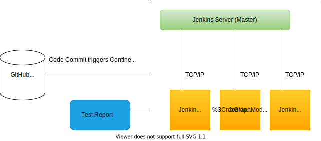

# Note 1:

## Jenkins master-slave architecture

### Overview

+ Jenkins master-slave architecture is a distributed build system that allows you to scale your build and deployment process.

+ It consists of a master node and one or more slave nodes.

### Master Node

+ The master node is the central node that manages the build and deployment process.
It is responsible for:

   + Scheduling builds

   + Assigning builds to slave nodes

   + Monitoring build progress

   + Storing build artifacts

   + Providing a web interface for users to interact with Jenkins

# Slave Node

+ A slave node is a machine that runs the Jenkins agent and executes builds assigned by the master node.

+ Slave nodes can be:

    + Physical machines

    + Virtual machines

    + Containers (e.g. Docker)

+ Slave nodes are responsible for:

    + Executing builds

    + Reporting build results to the master node

    + Providing build artifacts to the master node

### How it Works ?

    
+ The master node schedules a build and assigns it to a slave node.
    
+ The slave node executes the build and reports the results to the master node.
    
+ The master node stores the build artifacts and provides them to users through the web interface.
    
+ If a slave node goes offline, the master node can reassign the build to another available slave node.

### Benefits

+ Scalability: Add more slave nodes to increase build capacity.

+ Flexibility: Use different slave nodes for different build environments (e.g. different operating systems).

+ Reliability: If a slave node fails, the master node can reassign builds to other nodes

# Note 2:

