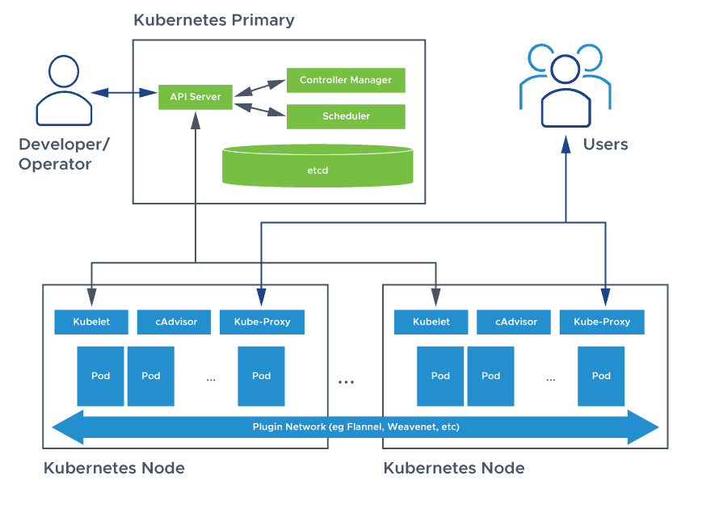

# Kubernetes Basics

---

### Master Node:

+ **The master node is the central component of a Kubernetes cluster**
+ **It runs the control plane components, which are responsible for managing the cluster**

+ **The master node is responsible for:**

  + Scheduling pods on worker nodes
  + Maintaining the cluster state
  + Providing a unified view of the cluster
  + Handling API requests from clients

### Control Plane Components:

+ **API Server:**

  + Exposes the Kubernetes API
Handles API requests from clients
Validates and processes API requests

+ **Controller Manager:**

  + Runs and manages control plane components
  + Monitors and maintains the cluster state
  + Performs tasks such as node management and pod scheduling

+ **Scheduler:**

  + Responsible for scheduling pods on worker nodes
  
  + Takes into account node availability, resource utilization, and pod requirements
  
  + Assigns pods to nodes based on scheduling decisions

+ **Worker Node:**

  + A worker node is a machine that runs pods 
  
  + Each worker node runs:

+ **Kubelet:**
  + Responsible for running pods on the node
  
  + Monitors and reports node and pod status
  + Executes pod containers

+ **Container Runtime:**

  + Responsible for running containers
Provides a runtime environment for containers

  + Examples include Docker, rkt, and cri-o

+ **Pod:**

    +  A pod is the basic execution unit in Kubernetes

    + A pod represents a single instance of a running application
    
    + A pod can contain one or more containers
    
    + Pods are ephemeral and can be created, scaled, and deleted as needed

+ **Service:**

  + A service is a logical abstraction over a set of pods
  + A service provides a stable network identity and load balancing for accessing pods
  + Services can be exposed to the outside world or used internally within the cluster

### **Persistent Volumes (PVs) and StorageClasses:**

+ **Persistent Volumes (PVs):**

  + Provide persistent storage for pods
Can be provisioned dynamically or statically

  + Can be used by multiple pods

+ **StorageClasses:**

  + Define the type of storage provided by a PV
 + Determine the characteristics of the storage, such as performance and capacity

### Networking:

+ **Pod Networking:**

  + Each pod gets its own IP address
  + Pods can communicate with each other using their IP addresses

+ **Service Networking:**

  + Services get their own IP address
  + Services can be accessed using their IP address and port

### Other Components:

+ **etcd:**
  + A distributed key-value store
  + Used to store cluster state and configuration

+ **kube-proxy:**

  + A network proxy that runs on each node
  + Provides load balancing and network routing for services

