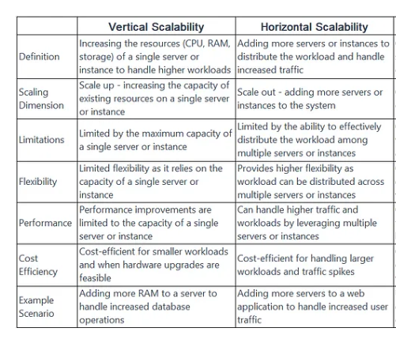

## Scaling Concept

 

## 1. Vertical Scaling:

+ It is also known as "scaling up"
+ Increasing the power or capacity of a single node or server
+ Upgrading the hardware or software of a single server to improve performance

### Examples:

+ Adding more CPU, RAM, or storage to a single server
+ Upgrading to a faster processor or more efficient storage system
+ Increasing the number of cores or threads on a single server

### Advantages:

+ Easier to manage and maintain, as there is only one server to worry about

+ Can be more cost-effective in the short term

### Disadvantages:

+ Limited by the maximum capacity of a single server

+ Can become a single point of failure, where if the server goes down, the entire system is affected

+ May not be suitable for high-traffic or high-availability applications

## 2.Horizontal Scaling:

+ It is also known as "scaling out"
+ Adding more nodes or servers to a system to increase capacity and performance
+ Distributing the workload across multiple servers to improve responsiveness and availability

### Examples:
+ Adding more servers to a web farm or cluster
+ Creating a load balancer to distribute traffic across multiple servers
+ Implementing a distributed database system across multiple nodes

### Advantages:

+ Can handle high traffic and large amounts of data more effectively
+ Provides high availability and redundancy, as if one server goes down, others can take over
+ Can be more flexible and adaptable to changing workloads

### Disadvantages:
+ Can be more complex and difficult to manage, as there are multiple servers to worry about
+ May require additional infrastructure and resources, such as load balancers and networking equipment
+ Can be more expensive in the long term, as more servers and resources are required

## Difference between Vertical scaling Vs Horizontal Scaling

