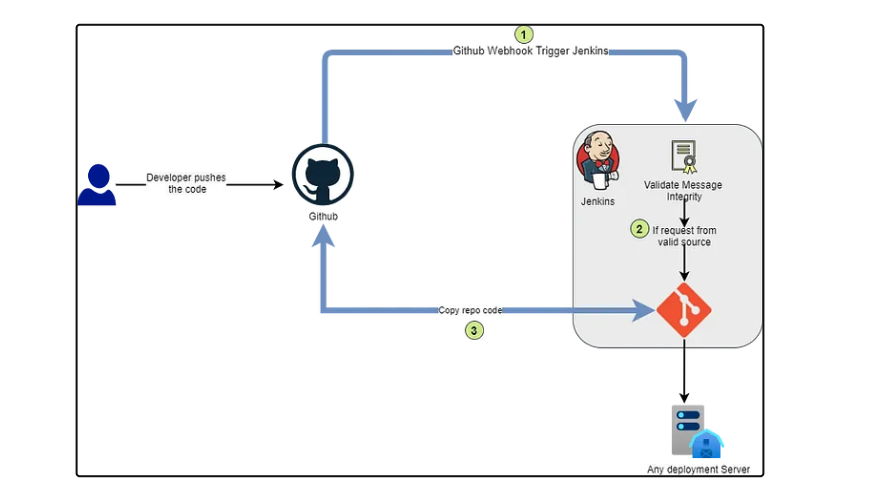
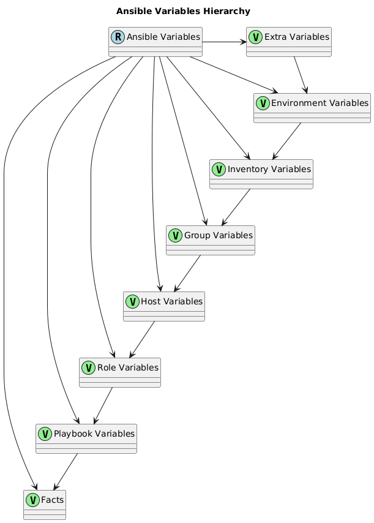

# Notes 1:

## Webhooks in jenkins




<br>
<hr>

### What is a Webhook in Jenkins?


+ A webhook is a way for an external application to notify Jenkins of an event, triggering a build or other action.

+ Webhooks allow you to integrate Jenkins with other tools and services, automating workflows and improving continuous integration and delivery.

### How Does a Webhook Work in Jenkins?


+ An external application (e.g., GitHub, GitLab, Bitbucket) sends an HTTP POST request to a Jenkins URL.

+ The request includes data about the event, such as a commit or push.

+ Jenkins receives the request and triggers a build or other action based on the event data.

### Benefits of Using Webhooks in Jenkins


+ Automate builds and deployments on code changes.

+ Improve collaboration between developers and operations teams.

+ Enhance continuous integration and delivery (CI/CD) pipelines.

+ Reduce manual intervention and errors.


### Configuring Webhooks in Jenkins


+ In Jenkins, go to Configure Jenkins > Configure System.

+ Scroll down to Webhook and click Add Webhook.

+ Enter the URL of the external application and select the event type (e.g., push, commit).

+ Configure any additional settings, such as authentication or payload parsing.


### Example Webhook Configuration in Jenkins

```groovy
pipeline {
    agent any

    triggers {
        webhook {
            url 'https://your-jenkins-instance.com/webhook'
            credentialsId 'your-credentials-id'
            token 'your-token'
        }
    }

    stages {
        stage('Build') {
            steps {
                sh 'make build'
            }
        }
    }
}
```

### Common Use Cases for Webhooks in Jenkins


+ Trigger a build on code push to a Git repository.

+ Deploy an application on merge of a pull request.

+ Run automated tests on commit.

+ Send notifications on build failure or success.


### what is payload URL ?

+ A payload URL refers to the actual data being transmitted within an API (Application Programming Interface) request or response. It is the essential content of the message being sent between a client (such as a web application or mobile app) and a server.

+ There are different payload formats used in APIs, including:

    + JSON (JavaScript Object Notation)

    + Other formats like XML (Extensible Markup Language) or binary data

##


# Notes 2:

## Ansible variables



<br>
<hr>

+ Different types of variable in Ansible

### 1. Extra Variables: 

+ These are variables that are passed to the playbook from the command line using the -e or --extra-vars option. They have the highest priority and can override any other type of variable.

+ Example: 

    + ansible-playbook -e  "my_var=value" playbook.yml

### 2. Environment Variables: 

+ These are variables that are set in the environment where the playbook is running. They can be accessed using the environment keyword in the playbook.

+ Example: 

    + environment: MY_VAR: value

### 3. Inventory Variables: 

+ These are variables that are defined in the inventory file (e.g. hosts file). They can be used to set variables for specific hosts or groups.

+ Example: 

    + [group1:vars] my_var=value

### 4. Group Variables: 

+ These are variables that are defined in a file named after the group in the group_vars directory. They are used to set variables for a specific group of hosts.

+ Example: 

    + group_vars/group1.yml contains my_var: value

### 5. Host Variables: 

+ These are variables that are defined in a file named after the host in the host_vars directory. They are used to set variables for a specific host.

+ Example: 

    + host_vars/host1.yml contains my_var: value

### 6. Role Variables: 

+ These are variables that are defined in a role's defaults directory. They are used to set default values for variables used in the role.

+ Example: 
    + roles/my_role/defaults/main.yml contains my_var: value

### 7. Playbook Variables: 

+ These are variables that are defined in the playbook itself using the vars keyword. They can be used to set variables for the entire playbook.

+ Example: 
    + vars: my_var: value

### 8. Facts: 

+ These are variables that are automatically set by Ansible based on the host's configuration, such as its IP address, operating system, etc.

+ Example: 

    + ansible_facts['os_family']

+ ###  Priority Order (from highest to lowest)

    + Extra Variables
    + Environment Variables
    + Inventory Variables
    + Group Variables
    + Host Variables
    + Role Variables
    + Playbook Variables
    + Facts

<hr>


# Note 3:

## Jinja2 template:

