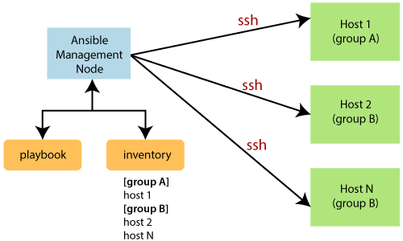

# Notes 1:

+ Ansible inventory structure 
```ini
[group name]
name ansible_host = {ip address} ansible_user= {user} ansible_ssh_private_key_file = {~/.ssh/key.pem}
```
+ It can also have mulitple groups in single file of inventory

```ini
[webserver]

name ansible_host = {ip address} ansible_user= {user} ansible_ssh_private_key_file = {~/.ssh/key.pem}

[db server]

[appserver]
```


+ The above file will use to get connection with different system which we will define through value in the variable which are mentioned in {} brackets.


+ we have to set file permission chmod 400 {key.pem} which is necessary to give permission to current user

+ ad-hoc command of ansible is looks like 

```bash
ansible -i inventory.ini [group_name] -m 'command to execute'
```

+ Ad-Hoc command syntax:


```bash
ansible 
```

<hr>


## What is Ansible?

+ ***Definition:*** Ansible is an open-source automation tool used for configuration management, application deployment, and task automation.

+ ***Agentless:*** It operates over SSH and does not require any agent software on the managed nodes.

+ ***Declarative Language:*** Uses YAML to define tasks and configurations, making it readable and easy to understand.

## What is a Playbook?


+ ***Definition:*** A playbook is a file written in YAML that defines a set of instructions (plays) to be executed on a set of hosts.

+ ***Purpose:*** Playbooks are used to configure systems, deploy software, and orchestrate tasks.

+ ***Structure:***

+ ***Plays:*** Individual tasks grouped under a play.

+ ***Tasks:*** Actions to be executed on the hosts.

> Example and Syntax

+ Playbook Example:

```yaml

- name: Ensure Apache is installed and running
  hosts: webservers
  become: yes
  tasks:
    - name: Install Apache
      yum:
        name: httpd
        state: present

    - name: Start Apache service
      service:
        name: httpd
        state: started
        enabled: yes
```

### Explanation:


+ name: Describes the playbook or play.

+ hosts: Specifies the group of hosts on which the tasks will be executed.

+ become: Indicates whether to use privilege escalation (sudo).

+ tasks: Lists the tasks to perform. Each task uses a module (e.g., yum, service).


##



##

## Why Use Ansible?


+ Simplicity: Uses human-readable YAML files for configuration.

+ Agentless: No need for agent software on the target nodes.

+ Scalability: Can manage large numbers of systems from a central control node.

+ Consistency: Ensures uniform configuration across multiple servers.

+ Idempotency: Tasks can be run multiple times without changing the system if it's already in the desired state.

## How It Works


+ Inventory: Ansible reads the inventory file to determine which hosts to manage.

+ Playbook Execution: Executes the tasks defined in playbooks on the specified hosts.

+ Modules: Uses Ansible modules (e.g., yum, service) to perform operations on the hosts.

+ SSH Connection: Communicates with hosts over SSH, executing tasks and collecting results.

+ Reporting: Provides feedback on the tasks executed, including any errors or changes made.


## Ansible Ad-Hoc Commands

+ Definition: Ad-hoc commands are used for quick tasks without writing a playbook.

+ Syntax: 

```bash
ansible <host-pattern> -m <module> -a "<module-options>"
```
Example:

```sh
ansible all -m ping
```
### Explanation:

+ all: Target all hosts in the inventory.

+ -m ping: Use the ping module to check connectivity.

+ -a "<module-options>": Module-specific options (empty for ping).

## Inventory File


+ ***Definition:*** An inventory file defines the hosts and groups of hosts Ansible will manage.

+ ***Purpose:*** Specifies which servers to target and can group them logically.

+ ***Syntax:***


```INI Format:```

```ini
[webservers]
web1.example.com
web2.example.com

[dbservers]
db1.example.com
db2.example.com
```
+ YAML Format:

```yaml
all:
  hosts:
    web1.example.com:
    web2.example.com:
  children:
    webservers:
      hosts:
        web1.example.com:
        web2.example.com:
    dbservers:
      hosts:
        db1.example.com:
        db2.example.com:
```
### Explanation:


+ Groups: [webservers], [dbservers] define groups of hosts.

+ Hosts: List individual hosts under each group.

+ Children: Allows nesting of groups (e.g., webservers and dbservers under all).


+ ##### Note:  Ansible simplifies and automates system management, making it a valuable tool for sysadmins and DevOps professionals.