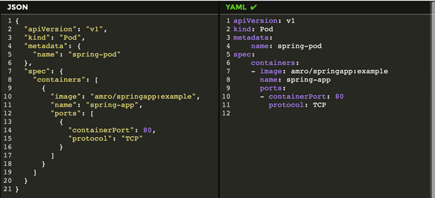

## Kube structure 

---

### Root Directory

+ The root directory of a Kubernetes project typically contains the following subdirectories and files:

  + deployments/: contains deployment YAML files

  + services/: contains service YAML files

  + pods/: contains pod YAML files (optional)

  + configmaps/: contains configmap YAML files

  + secrets/: contains secret YAML files
  
  + persistentvolumes/: contains persistent volume YAML files
  
  + namespaces/: contains namespace YAML files (optional)
  
  + roles/: contains role YAML files (optional)
  
  + clusterroles/: contains cluster role YAML files (optional)
  
  + rolebindings/: contains role binding YAML files (optional)
  
  + clusterrolebindings/: contains cluster role binding YAML files (optional)
  
  + kustomization.yaml: a file that defines the kustomization configuration (optional)

### Deployments Directory

+ The deployments/ directory contains YAML files that define deployments:
+ Each YAML file defines a single deployment

+ File names typically follow the format "deployment-name".yaml

> Example: my-web-app.yaml

+ A deployment YAML file typically contains the following fields:

  + apiVersion: the API version of the deployment
  
  + kind: the type of object (in this case, Deployment)

  + metadata: metadata about the deployment (e.g. name, namespace)
  
  + spec: the specification of the deployment (e.g. container images, replicas)
  
  + selector: the selector that matches the pods managed by the deployment

### Services Directory

+ The services/ directory contains YAML files that define services:
+ Each YAML file defines a single service
File names typically follow the format "service-name".yaml

>Example: my-web-app-svc.yaml

+ A service YAML file typically contains the following fields:

  + apiVersion: the API version of the service
  
  + kind: the type of object (in this case, Service)
  
  + metadata: metadata about the service (e.g. name, namespace)
  
  + spec: the specification of the service (e.g. port, selector)

  + ports: the ports exposed by the service

### Pods Directory

+ The pods/ directory contains YAML files that define pods (optional):
+ Each YAML file defines a single pod
+ File names typically follow the format "pod-name".yaml

> Example: my-web-app-pod.yaml

+ A pod YAML file typically contains the following fields:

  + apiVersion: the API version of the pod
  + kind: the type of object (in this case, Pod)
  + metadata: metadata about the pod (e.g. name, namespace)
  + spec: the specification of the pod (e.g. containers, volumes)

### ConfigMaps Directory

+ The configmaps/ directory contains YAML files that define config maps:
+ Each YAML file defines a single config map
+ File names typically follow the format "configmap-name".yaml

> Example: my-web-app-config.yaml

+ A config map YAML file typically contains the following fields:
  + apiVersion: the API version of the config map
  + kind: the type of object (in this case, ConfigMap)
  + metadata: metadata about the config map (e.g. name, namespace)
  + data: the key-value pairs stored in the config map

### Secrets Directory

+ The secrets/ directory contains YAML files that define secrets:
+ Each YAML file defines a single secret
+ File names typically follow the format "secret-name>"yaml

> Example: my-web-app-secret.yaml
+ A secret YAML file typically contains the following fields:
  + apiVersion: the API version of the secret
  + kind: the type of object (in this case, Secret)
  + metadata: metadata about the secret (e.g. name, namespace)
  + data: the encrypted key-value pairs stored in the secret

### Persistent Volumes Directory

+ The persistentvolumes/ directory contains YAML files that define persistent volumes:
+ Each YAML file defines a single persistent volume
+ File names typically follow the format "pv-name".yaml

> Example: my-web-app-pv.yaml

+ A persistent volume YAML file typically contains the following fields:

  + apiVersion: the API version of the persistent volume
  + kind: the type of object (in this case, PersistentVolume)
  + metadata: metadata about the persistent volume (e.g. name, namespace)
  + spec: the specification of the persistent volume (e.g. capacity, access modes)

### Namespaces Directory

+ The namespaces/ directory contains YAML files that define namespaces (optional):
+ Each YAML file defines a single namespace
+ File names typically follow the format "namespace-name".yaml

> Example: my-web-app-ns.yaml

+ A namespace YAML file typically contains the following fields:

  + apiVersion: the API version of the namespace
  + kind: the type of object (in this case, Namespace)
  + metadata: metadata about the namespace (e.g. name)

### Roles and ClusterRoles Directories

+ The roles/ and clusterroles/ directories contain YAML files that define roles and cluster roles (optional):
+ Each YAML file defines a single role or cluster role
+ File names typically follow the format "role-name".yaml

> Example: my-web-app-role.yaml

+ A role or cluster role YAML file typically contains the following fields:

  + apiVersion: the API version of the role or cluster role
  + kind: the type of object (in this case, Role or ClusterRole)
  + metadata: metadata about the role or cluster role (e.g. name, namespace)
  + rules: the rules that define the permissions granted by the role or cluster role

### RoleBindings and ClusterRoleBindings Directories

+ The rolebindings/ and clusterrolebindings/ directories contain YAML files that define role  bindings and cluster role bindings (optional):

+ Each YAML file defines a single role binding or cluster role binding
+ File names typically follow the format "rolebinding-name".yaml

> Example: my-web-app-rolebinding.yaml

+ A role binding or cluster role binding YAML file typically contains the following fields:

  + apiVersion: the API version of the role binding or cluster role binding
  + kind: the type of object (in this case, RoleBinding or ClusterRoleBinding)
  + metadata: metadata about the role binding or cluster role binding (e.g. name, namespace)
  + roleRef: the reference to the role or cluster role being bound
  + subjects: the subjects (e.g. users, groups) that are bound to the role or cluster role

### Kustomization File

+ The kustomization.yaml file defines the kustomization configuration (optional):
+ This file is used to configure the kustomize tool
+ It specifies the resources to be included in the kustomization
+ It can also specify patches, transformations, and other customizations to be applied to the resources
    