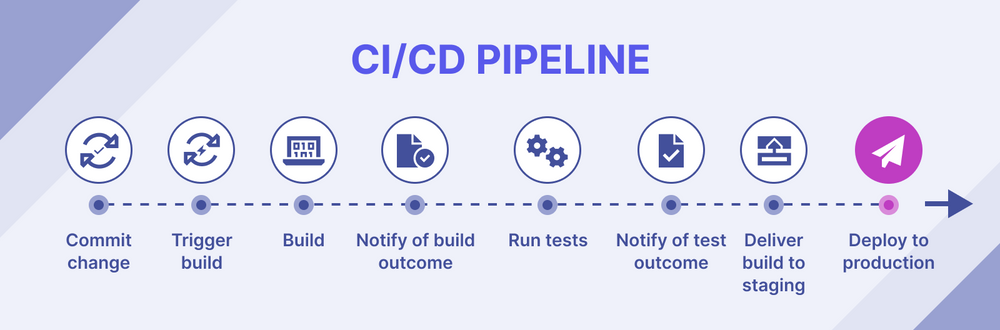

# Notes:1

## ***CI/CD Pipeline***

## Continuous Integration (CI):

 1. ***Automated Build:*** Automatically build the code into an executable package whenever a developer commits changes to the code repository.

 2. ***Automated Testing:*** Run automated tests to ensure the code changes do not break the existing functionality.

 3. ***Early Defect Detection:*** Identify and fix defects early in the development cycle, reducing the chances of downstream problems.

 4. ***Faster Feedback:*** Provide immediate feedback to developers on the success or failure of their code changes.

 5. ***Improved Code Quality:*** Enforce coding standards, best practices, and code reviews to improve overall code quality.

 6. ***Reduced Integration Problems:*** Integrate code changes from multiple developers into a single, unified codebase, reducing integration problems.

## Continuous Delivery (CD):

 1. ***Automated Deployment:*** Automatically deploy the built and tested code to production or staging environments.

 2. ***Faster Time-to-Market:*** Reduce the time it takes to deliver new features and bug fixes to end-users.

 3. ***Lower Risk:*** Automate deployment to reduce the risk of human error and minimize downtime.

 4. ***Improved Collaboration:*** Align development, QA, and operations teams to work together to deliver high-quality software.

 5. ***Continuous Monitoring:*** Monitor application performance and user feedback to identify areas for improvement.

## Continuous Deployment (CD):

 1. ***Automated Release:*** Automatically release the deployed code to production, without human intervention.

 2. ***Zero-Downtime Deployments:*** Deploy code changes without interrupting end-users or causing downtime.

 3. ***Faster Feedback Loop:*** Get immediate feedback from end-users and iterate quickly to improve the application.

 4. ***Higher Quality:*** Ensure high-quality software by automating testing, deployment, and release processes.

## CI/CD Pipeline:

 1. ***Source Code Management:*** Manage source code in a version control system like Git.

 2. ***Build Automation:*** Automate the build process using tools like Jenkins, Travis CI, or CircleCI.

 3. ***Automated Testing:*** Run automated tests using tools like JUnit, PyUnit, or Selenium.

 4. ***Deployment Automation:*** Automate deployment to production or staging environments using tools like Ansible, Docker, or Kubernetes.

 5. ***Monitoring and Feedback:*** Monitor application performance and gather user feedback to improve the application.

---
 

## Benefits of CI/CD:

 1. ***Faster Time-to-Market:*** Reduce the time it takes to deliver new features and bug fixes.

 2. ***Improved Quality:*** Ensure high-quality software by automating testing and deployment processes.

 3. ***Reduced Risk:*** Minimize the risk of human error and downtime.

 4. ***Increased Collaboration:*** Align development, QA, and operations teams to work together to deliver high-quality software.

 5. ***Cost Savings:*** Reduce costs by automating repetitive tasks and minimizing downtime.

---

# Notes : 2

## ***Cron-job***

+ ### The crontab syntax consists of five fields with the following possible values:

1. ***Minute*** :  The minute of the hour the command will run, ranging from 0-59.

2. ***Hour***: The hour the command will run, ranging from 0-23 in a 24-hour notation.

3. ***Day of the month*** : The date of the month the user wants the command to run, ranging from 1-31.

4. ***Month***: The month that the user wants the command to run. It ranges from 1-12, representing January until December.

5. ***Day of the week*** : The day of the week for a command to run, ranging from 0-6. The value represents Sunday-Saturday. In some systems, the value 7 represents Sunday.

+ #### In addition to the syntax, you must understand the cron job operators to modify the value in each field. You must properly use these operators in all crontab files to ensure your commands run:

1. ***Asterisk (*)*** : This operator signifies all possible values in a field. For example, write an asterisk in the Minute field to make the cron job run every minute.

2. ***Comma (,)***: An operator for listing multiple values. For example, writing 1,5 in the day-of-week field will schedule the job to run every Monday and Friday.

3. ***Hyphen (-)*** : Users can determine a range of values. Write 6-9 in the Month field to set up a cron job from June to September.

4. ***Separator (/)*** : This separator divides a value. If you want to run a script every twelve hours, write */12 in the Hour field.

5. ***Last (L)*** : Users can use this operator in the day-of-month and day-of-week fields. For example, writing 3L in the day-of-week field means the last Wednesday of the month.

6. ***Weekday (W)*** : An operator that determines the closest weekday from a given time. For example, if the 1st of a month is a Saturday, writing 1W in the day-of-month field will run the command on Monday the 3rd.

7. ***Hash (#)*** : An operator for the day-of-week field that determines a specific day of the month, using a number between 1 to 5. For instance, 1#2 means the second Monday of the month.

8. ***Question mark (?)*** : This operator inputs no specific value for the day-of-month and day-of-week fields. It’s typically replaced with the cron daemon start-up time.

 
 

## Examples of cronjob

| Example  | Explaination |   
|---------------------------| ------------:|
| 0 0 * * 0 /root/backup.sh	| Perform a backup every Sunday at midnight.  |   
| 0 * * * 1 /root/clearcache.sh | Clear the cache every hour on Mondays  |   
| 0 6,18 * * * /root/backup.sh	  |  Backup data twice a day at 6 am and 6 pm. |   
|*/10 * * * * /scripts/monitor.sh | Perform monitoring every 10 minutes|

----------------------------------------