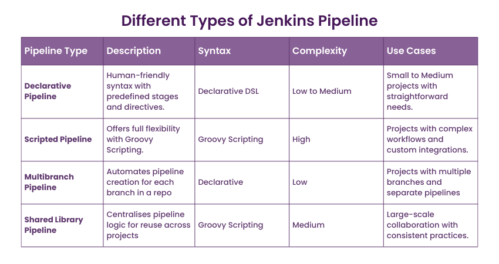

# Notes 1:

## Types of pipeline in jenkins:

<br>




## 1. Declarative Pipeline


+ Written in a more human-readable format

+ Easier to write and understand

+ Offers less control compared to scripted pipeline


```groovy

// Declarative Pipeline

pipeline {
    agent any

    stages {
        stage('Build') {
            steps {
                sh 'make build'
            }
        }
        stage('Test') {
            steps {
                sh 'make test'
            }
        }
        stage('Deploy') {
            steps {
                sh 'make deploy'
            }
        }
    }
}
```

## 2. Scripted Pipeline


+ Written in Groovy programming language

+ Offers more control and flexibility

+ Can be complex to write and manage


```groovy
// Scripted Pipeline

node {
    stage('Build') {
        sh 'make build'
    }
    stage('Test') {
        sh 'make test'
    }
    stage('Deploy') {
        sh 'make deploy'
    }
}
```

## 3. Multilbranch Pipeline


+ A pipeline that can handle multiple branches of a repository

+ Automatically creates a pipeline for each branch in the repository

+ Allows for different configurations for different branches

+ Useful for testing and deploying different versions of a project


```groovy
// Multibranch Pipeline

pipeline {
    agent any

    stages {
        stage('Build') {
            steps {
                checkout scm: [$class: 'GitSCM', branches: [[name: '*/branchName']]]
                sh 'make build'
            }
        }
        stage('Test') {
            steps {
                sh 'make test'
            }
        }
        stage('Deploy') {
            steps {
                sh 'make deploy'
            }
        }
    }
}
```

## 4. Shared library Pipeline 


+ A pipeline that allows for sharing of code and configurations between multiple pipelines

+ A library of reusable functions and classes that can be used across multiple pipelines

+ Useful for reducing code duplication and promoting consistency across pipelines

```groovy
// Shared Library Pipeline

@Library('utils') _

pipeline {
    agent any

    stages {
        stage('Build') {
            steps {
                utils.mvn 'clean package'
            }
        }
        stage('Test') {
            steps {
                utils.test()
            }
        }
        stage('Deploy') {
            steps {
                utils.deploy()
            }
        }
    }
}
```


# Notes 2:

## Components of Jenkins Pipeline

 1. ***Agent:*** The agent section specifies where the entire pipeline or a specific stage will execute in the Jenkins environment. It can be defined at the top-level or inside a stage.

 2. ***Stages:*** The stages section defines a series of one or more stage directives. The stages are used to visualize the Jenkins pipeline process. Each stage can have multiple steps.

 3. ***Steps:*** The steps section defines a series of one or more step directives. The steps are used to define the actions that need to be executed in a stage. For example, build, test, deploy, etc.

 4. ***Post:*** The post section defines a series of one or more step directives that are executed at the end of the pipeline. This can be used to send notifications, clean up, etc.

 5. ***Options:*** The options section allows you to specify pipeline-specific options. For example, you can specify the timeout, retry count, etc.

 6. ***Triggers:*** The triggers section defines the automated ways in which the pipeline should be re-triggered. For example, you can specify a cron expression to trigger the pipeline at a specific interval.

 7. ***Parameters:*** The parameters section defines the parameters that need to be provided when triggering the pipeline. For example, you can specify a string parameter for the branch name.

 8. ***When:*** The when section specifies the conditions under which the stage should be executed. For example, you can specify a condition to execute the stage only when the branch is master.

 9. ***Environment:*** The environment section specifies the environment variables that need to be set for the pipeline.

 10. ***Script:*** The script section specifies a script that needs to be executed in the pipeline.


```groovy
pipeline {
    agent any

    stages {
        stage('Build') {
            steps {
                sh 'make build'
            }
        }
        stage('Test') {
            steps {
                sh 'make test'
            }
        }
        stage('Deploy') {
            steps {
                sh 'make deploy'
            }
        }
    }

    post {
        always {
            sh 'make cleanup'
        }
    }

    options {
        timeout(time: 1, unit: 'HOURS')
    }

    triggers {
        cron('H 4 * * 1-5')
    }

    parameters {
        string(name: 'BRANCH_NAME', defaultValue: 'master', description: 'Branch name')
    }

    when {
        branch 'master'
    }

    environment {
        CC = 'gcc'
    }

    script {
        def foo = 'bar'
        println foo
    }
}
```