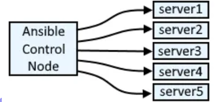
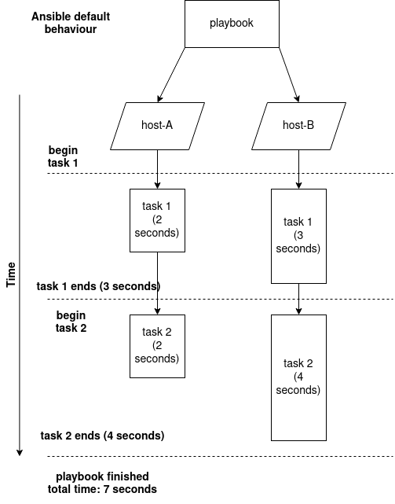

# Notes:

+ In Ansible, inventory plugins allow you to define the hosts and groups for your playbooks dynamically and flexibly. Here’s a basic explanation of inventory plugins using bullet points and a simple example:

### What Are Inventory Plugins?


+ Definition: Inventory plugins are modules in Ansible that dynamically generate the inventory of hosts and groups from various sources.

+ Purpose: They enable Ansible to gather and use inventory data from external systems, databases, cloud providers, or custom sources.

+ Configuration: Inventory plugins are defined in the ansible.cfg file or directly in the playbook or command line.

+ Types of Inventory Plugins
    
    + Built-in: Ansible comes with several built-in inventory plugins (e.g., ini, yaml, script, dynamic, aws_ec2).
    
    + Custom: You can also create custom inventory plugins to meet specific needs.
    
### Basic Usage Example

+ Let's consider a scenario where you want to use the yaml inventory plugin to define your inventory.

1. Create a YAML Inventory File

+ File Name: inventory.yaml

+ Content:

```yaml
all:
  hosts:
    webserver1:
      ansible_host: 192.168.1.10
    webserver2:
      ansible_host: 192.168.1.11
  children:
    web:
      hosts:
        webserver1:
        webserver2:
    db:
      hosts:
        dbserver1:
          ansible_host: 192.168.1.20
```

2. Configure Ansible to Use the YAML Inventory Plugin

+ File Name: ansible.cfg 
+ Content:

```ini
[defaults]
inventory = inventory.yaml
```
3. Run a Playbook Using the Inventory

+ Playbook: playbook.yaml

```yaml
- name: Example Playbook
  hosts: web
  tasks:
    - name: Ping the web servers
      ansible.builtin.ping:
```
+Command to Run:

```sh
ansible-playbook playbook.yaml
```

+ Example Output

    + When you run the playbook, Ansible will use the inventory.yaml file to get the list of hosts under the web group and execute the tasks defined in the playbook.

+ Summary
    
    + Inventory plugins help in dynamically managing hosts and groups in Ansible.
    
    + Built-in plugins include formats like YAML, INI, and cloud-specific plugins like AWS EC2.
    
    + Custom plugins can be developed for specialized use cases.
    
    + Example setup involves creating a YAML file for inventory and configuring Ansible to use it.


<hr>


# Notes 2:

## Fork in ansible inventory



<br>
<hr>
<br>

+ In Ansible, the forks parameter is used to control the number of parallel processes (or "forks") that Ansible uses when executing tasks across multiple hosts. Here's a bullet-point explanation of forks:

    
+ ***Definition:*** 

    + forks is a configuration parameter in Ansible that specifies the number of parallel processes used to run tasks on different hosts.
    
+ ***Purpose:*** 

    + The main purpose of setting forks is to control how many hosts Ansible can work on simultaneously. This can significantly impact the speed and efficiency of your playbook runs.
    
+ ***Configuration Location:*** 

    + forks is typically set in the Ansible configuration file (ansible.cfg), under the [defaults] section. You can also set it via the command line or environment variables.
    
+ ***Default Value:*** 
    
    + The default number of forks is usually set to 5, but this can vary based on the version of Ansible and the specific configuration.
    
+ ***Impact on Performance:*** 
    
    + Increasing the number of forks can improve the speed of playbook execution by allowing more hosts to be processed in parallel. However, setting it too high may lead to resource exhaustion on the control machine or network issues.

+ ***Setting the Value:*** 
    + You can set the number of forks in ansible.cfg like this:

```ini
[defaults]
forks = 20
```

+ Alternatively, you can specify it on the command line with the -f option:

```bash
ansible-playbook -f 20 playbook.yml
```
+ ***Resource Considerations:*** 

    + Be mindful of the control machine’s resources (CPU, memory) and the network capacity when adjusting the number of forks. More forks can put additional load on these resources.

+ ***Testing and Tuning:*** 

    + It’s often a good idea to test different values for forks to find the optimal setting for your environment. This helps balance performance improvements with system stability.


## Verbose in ansible


### Verbose Mode

+ Definition:

    + Verbose mode in Ansible is a feature that provides more detailed output during the execution of a playbook. It helps in debugging and understanding what’s happening under the hood.

+ Purpose:

    + To gain insight into the execution process, including detailed logs of what tasks are being run and their results.

+ To troubleshoot issues by seeing additional debugging information.

### How to Enable:

+ Verbose mode can be enabled by using the -v, -vv, or -vvv flags with the ansible-playbook command:


```bash
ansible-playbook playbook.yml -v
```
    
    + -v (or --verbose): Provides basic verbosity.
    
    + -vv: Provides more detailed verbosity.
    
    + -vvv: Provides the most detailed verbosity, including debug-level information.

### Output Details:


+ Basic verbosity (-v) will show task execution details, including which tasks are running and their status.

+ Increased verbosity (-vv or -vvv) will include additional information such as task details, module arguments, and any internal Ansible messages.

### Use Cases:


+ Debugging issues with playbook execution.

+ Understanding the flow and details of task execution.

+ Monitoring the output of Ansible modules and their responses.


## Asynchronous




### Definition:

+ Asynchronous mode in Ansible allows tasks to be run asynchronously, meaning they can continue to run in the background while the playbook continues to execute other tasks.

### Purpose:

+ To handle long-running tasks more efficiently by allowing Ansible to proceed with other tasks without waiting for the long-running task to complete.

### How to Use:

+ You configure asynchronous execution using the async and poll parameters within a task:

```yaml
- name: Run a long task asynchronously
  command: /path/to/long-running-script.sh
  async: 3600  # Maximum time in seconds for the task to run
  poll: 10      # Interval in seconds to check the task status
```

### Parameters:


+ async: Defines the maximum amount of time (in seconds) the task should run before being considered as failed if it hasn't completed.

+ poll: Defines how often (in seconds) Ansible should check the status of the asynchronous task. If set to 0, it will not poll and assume the task is complete.

### Output Handling:

+ Ansible will return a job ID immediately upon starting the asynchronous task. The result will be saved, and you can use another task to check the status and retrieve the result later if needed.

### Use Cases:


+ Executing tasks that take a long time to complete, such as large software installations, backups, or updates.

+ Running multiple long-running tasks in parallel, where each task can run independently of the others.

+ Example of Polling for Completion:

```yaml
- name: Check the status of the long-running task
  async_status:
    jid: "{{ async_result.ansible_job_id }}"
  register: job_result
  until: job_result.finished
  retries: 60
  delay: 10
```